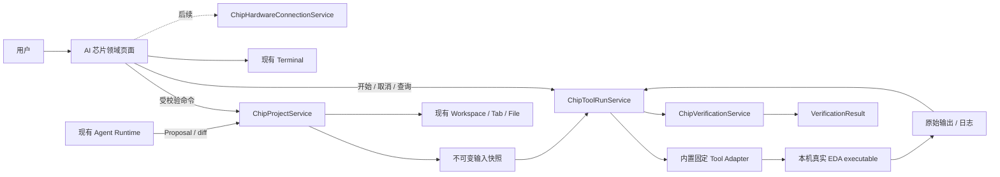
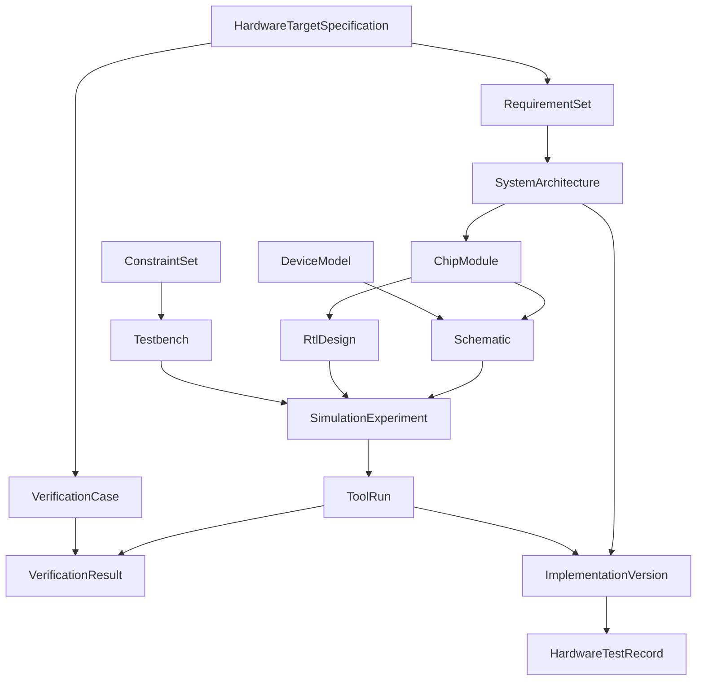

# AI 芯片工作台项目与运行架构

> 状态：架构方案，尚未实现。2026-10-10。
> 遵循 [架构宪法](../architecture.md)、[AI 芯片工作台产品设计](../features/ai-chip-workbench.md)、
> [工作空间系统](../features/workspace-system.md) 与
> [统一上下文操作](../features/context-action-system.md)。

## 结论与边界

AI 芯片工作台是现有 CCLink Studio 中的本地领域模块，不是第二种 Workspace、第二套 Workbench、
第二个 Agent Runtime 或独立桌面 App。它复用现有文件、Tab、Agent、Terminal、命令、权限、诊断和
生命周期，只新增芯片领域对象、固定 EDA 适配器、工具运行事实、验证结果和后续硬件连接边界。

首版架构只为一个真实闭环建立所需最小能力：一个芯片项目、一个经过验证的忆阻器模型、模板化模拟
电路、瞬态 Testbench、固定 ngspice 适配器、一个活动运行、波形读取、两次运行比较和证据保存。
数字 RTL、综合、物理实现、FPGA、真实器件和 PDK 有稳定对象入口，但不预建空服务或通用插件宿主。

本方案不需要违反架构宪法，因此当前不需要 ADR。若以后需要自动安装外部工具、执行用户脚本、远端
EDA、任意适配器加载、PDK 凭证扩张或硬件高风险控制，必须在实现前重新评审并在需要时先提交 ADR。

## 能力上下文



最重要的分界是：Agent 只产生 Proposal，Adapter 只描述工具调用和解析，`ChipToolRunService` 唯一
拥有外部进程与运行终态，`ChipVerificationService` 唯一拥有对用例的 verdict。

## 状态所有者

| 状态域 | 唯一所有者 | 持久化 | renderer／其他域的职责 |
| --- | --- | --- | --- |
| Workspace、Tab、Agent、Terminal | Studio 现有基础层 | 现有机制 | 芯片域只持 `workspaceKey`、Tab 或 Agent run 引用 |
| 芯片项目与已保存对象 | `ChipProjectService` | 项目目录中的版本化文档 | renderer 持草稿与 revision；Agent 只提交 Proposal |
| EDA 工具可用性 | `ChipToolRegistry` | 本机配置和短期 probe cache | UI 只显示 `ready/degraded/unavailable/failed` 快照 |
| 工具运行、子进程、取消和终态 | `ChipToolRunService` | 每个 `runs/<run-id>/run.json` | Adapter 无状态；renderer 查询／订阅，不写终态 |
| 验证 verdict 与度量 | `ChipVerificationService` | `verification/results/` | 只消费已登记输出；AI 可解释但不能写 verdict |
| 实现版本定义 | `ChipProjectService` | `implementations/<id>/implementation.json` | 工具 run 只被引用，不复制状态 |
| FPGA／硬件连接 | `ChipHardwareConnectionService`（后续） | 本机连接配置；运行证据进项目 | Android owner 不复用；UI 不推测连接成功 |
| 硬件测试记录 | `ChipHardwareTestService`（后续） | `hardware/tests/<id>/` | 必须绑定真实连接、刺激、采样和安全确认 |
| 视图选择、展开、游标 | renderer 领域 store | WorkspaceState 可丢弃投影 | 不能成为运行或验证事实 |

一个 Workspace 可包含多个 `ChipProject`；`chipProjectId` 不替代 `workspaceKey`。芯片域不得复制
Workspace 列表、文件树、Tab、Terminal session 或 Agent conversation。

## 对象关系



对象引用不靠显示名称。结构化引用至少包含：

```ts
interface ChipObjectRef {
  id: string
  kind: ChipObjectKind
  relativePath: string
  revision: number
  sha256?: string
}
```

可编辑对象使用 `revision` 做乐观并发控制；运行输入在快照完成后使用 SHA-256 固定。外部移动、ID
不一致或 revision 冲突都必须显示冲突，不得按同名文件静默重绑。

## 芯片工程目录

以下是目标结构。实现只创建当前纵向闭环真正使用的目录，不批量生成未来空目录。

```text
现有本地工作空间/
└── chips/
    └── memristor-pulse/
        ├── chip.project.json                  # 领域入口和对象索引
        ├── README.md                          # 目标、依赖和复现步骤
        ├── imports/
        │   └── hardware-targets/
        │       └── <target-id>/<revision>/    # 原始 HTS 包与 import manifest
        ├── requirements/
        │   ├── requirements.yaml
        │   └── traceability.json
        ├── architecture/
        │   └── system.architecture.yaml
        ├── modules/
        │   └── <module-id>.module.yaml
        ├── models/
        │   └── devices/<model-id>/
        │       ├── device.model.yaml          # 元数据、单位、来源、适用范围
        │       ├── model.cir                  # 首版受支持的 SPICE 模型源
        │       └── golden/                    # 模型自身验证向量与期望范围
        ├── schematics/
        │   └── pulse-response.schematic.json  # 电气图 + 非电气画布布局
        ├── rtl/                               # 后续；当前仅普通源文件索引
        ├── constraints/
        │   └── simulation.constraints.yaml
        ├── testbenches/
        │   └── pulse-response.testbench.yaml
        ├── experiments/
        │   └── pulse-response.experiment.yaml
        ├── verification/
        │   ├── cases/<case-id>.verification.yaml
        │   └── results/<result-id>.result.json
        ├── implementations/
        │   └── <implementation-id>/implementation.json
        ├── runs/
        │   └── <run-id>/
        │       ├── run.json                   # 运行 owner 的状态与时间线
        │       ├── input-manifest.json        # 输入、revision、哈希、单位
        │       ├── inputs/                    # 自包含源快照
        │       ├── generated/                 # 适配器生成的网表／控制文件
        │       ├── invocation.json            # 脱敏 executable/argv/env 摘要
        │       ├── outputs/                   # 工具原始输出，不由 UI 改写
        │       ├── parsed/                    # 有版本的规范化信号／度量索引
        │       ├── logs/                      # stdout/stderr 与诊断
        │       └── evidence.json              # 证据文件、大小和哈希总表
        ├── hardware/
        │   └── tests/<hardware-test-id>/      # 后续真实测试证据
        └── reports/                           # 可编辑比较／设计报告
```

### 源码、模型、约束、实验、运行和报告的关系

1. `requirements`、`architecture`、`modules`、`models`、`schematics`、`rtl`、`constraints`、
   `testbenches` 和 `experiments` 是用户可编辑的源对象。
2. `SimulationExperiment` 只保存引用和参数覆盖，不保存运行状态。
3. 开始运行时，`SnapshotBuilder` 解析引用、校验 revision 和单位，把完整依赖复制到 `inputs/`。
4. Adapter 只从不可变 `inputs/` 生成 `generated/`；不得从用户仍在编辑的源路径边跑边读。
5. `outputs/` 是外部工具原始产物；`parsed/` 是带 parser 版本和源哈希的可重建派生数据。
6. `VerificationResult` 引用 `ToolRun`、验证用例和具体度量；不修改原始输出。
7. `reports/` 可以编辑叙述和选择视图，但必须固定引用 run／result ID；修改报告不改变 verdict。
8. `ImplementationVersion` 固定一个确认的设计基线和真实工具运行集合；它不是目录快照的别名。

项目可以选择用 Git 跟踪源对象、验证结果和报告。大输出是否入库由用户决定；若未包含 runs，导出的
包必须明确标为“只有源与索引，缺少完整运行证据”。第三方模型、PDK 和许可证文件不得自动提交。

## 共享数据契约

结构化对象使用 JSON 或 YAML，加载后全部通过 shared Zod schema 校验。自由格式的 SPICE、RTL、
SDC、Liberty、LEF／DEF 等源文件保持原格式，但必须由 manifest 声明类型、编码、相对路径和哈希。

统一 envelope：

```ts
interface ChipDocumentEnvelope<TKind extends string, TBody> {
  schemaVersion: string
  kind: TKind
  id: string
  chipProjectId: string
  revision: number
  createdAt: string
  updatedAt: string
  body: TBody
}
```

物理量禁止裸 number：

```ts
interface Quantity {
  value: number
  unit: string
  tolerance?: { absolute?: number; relative?: number; unit?: string }
}
```

首版单位集合固定并可转换；未知单位保留原值但阻止运行。后续引入数字四态、复数、corner 和统计分布
时扩展 schema 版本，不能用字符串解析临时绕过。

## 运行状态机

首版每个芯片项目最多一个活动 ToolRun，不排队，不新增通用调度器。

```text
created
  → snapshotting
  → prepared
  → running
  → succeeded
  → failed

running → cancelling → cancelled
running / cancelling --App owner lost--> interrupted
created / snapshotting / prepared → failed
```

- `succeeded` 要求：进程按适配器规则成功退出、必需输出存在、大小在限额内且 parser 完成。
- `failed` 保留阶段、结构化错误和已有部分输出；不会删除旧 run。
- `cancelling` 必须等进程树终止和输出写入停止后才能变 `cancelled`；断流不是取消成功。
- App 正常退出时先请求停止并刷盘；超出有界等待则下次启动对账为 `interrupted`。
- 重启不自动续跑。用户选择“按相同输入重跑”会创建新 run，并通过 `replacesRunId`／`basedOnRunId`
  保留关系。
- 工作空间切换只解绑 renderer 订阅；运行继续绑定创建时的 `workspaceKey + chipProjectId`。

ToolRun 终态不能由 WorkspaceState、renderer store、Agent 消息或适配器日志文本反向覆盖。

## 外部 EDA 工具适配层

### 固定适配器注册

首版适配器随 Studio 源码编译和发布：

```ts
interface EdaToolAdapter {
  readonly adapterId: string
  readonly adapterVersion: string
  readonly toolKind: 'circuit-simulator' | 'rtl-simulator' | 'synthesis' | 'physical' | 'fpga'
  probe(context: ToolProbeContext): Promise<ToolProbeResult>
  validate(snapshot: RunInputSnapshot): Promise<AdapterValidationResult>
  prepare(snapshot: RunInputSnapshot, outputRoot: string): Promise<PreparedInvocation>
  parse(result: ProcessResult, outputRoot: string): Promise<ParsedRunOutput>
  classifyFailure(result: ProcessResult, parse?: ParseFailure): ToolRunError
}
```

Adapter **不直接拥有子进程**。它返回可校验的 `executable + argv[] + cwd + envAllowlist +
expectedOutputs`；`ChipToolRunService` 统一 spawn、取消、超时、日志截断、进程树清理和状态提交。

不支持从项目目录加载 JavaScript、动态库或 executable manifest。新增适配器需要源码评审、固定 contract、
兼容样例和真实工具验收，不通过运行时插件发现。

### 工具探测

探测顺序固定：

1. 用户在本机设置中明确选择的绝对路径；
2. 适配器允许的标准安装位置；
3. 受限 PATH 名称，例如首版只查 `ngspice`；
4. 对候选执行无副作用的版本命令，并设置超时和输出上限；
5. 校验工具名称、语义版本、CPU／平台和适配器支持范围。

`ToolProbeResult` 区分 `ready`、`degraded`、`unavailable`、`failed`。找到同名 executable 但版本文本
不匹配时不能标 ready。Probe cache 只优化 UI；每次运行仍保存当次版本和 executable 指纹。

首版不自动安装 ngspice。若以后复用 Runtime Component 管理，需先证明来源、签名、版本配对、GPL
分发和回退边界；工具缺失始终只能降级 AI 芯片运行，不得阻断 Studio 启动。

### 输入生成

- 生成只读取已经提交的 `inputs/` 快照；
- 路径使用受控工作目录和参数数组，不拼接 shell；
- 输出必须确定性排序，并记录 generator／adapter 版本；
- 首版网表只来自受控 Schematic 和受支持模型，不自动运行导入文件中的 `.control`、shell、动态 CodeModel
  或任意脚本；
- 用户提供的未知 SPICE 文件可以查看和导入为未管理源，但通过语法与能力白名单前不能运行；
- 生成后重新计算哈希，写入 `input-manifest.json`，再原子提交 `prepared`。

### 进程运行与取消

- 主进程使用 `spawn(executable, argv, { shell: false })`；renderer 不接触 Node 或 executable 路径；
- `cwd` 固定在当前 run，环境从最小允许列表构造，不继承 Studio 凭证；
- stdout、stderr、总运行时间、输出大小和同时运行数均有限额；
- 取消先发协作式终止，再在有界时间后终止进程树；状态在确认退出前保持 `cancelling`；
- 取消后产生的文件标 `partial`，只能查看，不能自动形成 passed VerificationResult；
- 进程退出、输出 flush 和 parser 完成可能竞态，唯一终态由 RunService 原子写入。

这种方式不是 OS 沙箱。首版通过固定 executable、受控生成输入、最小环境和用户显式运行缩小风险，
不能宣传为安全执行任意第三方模型。

### 输出解析

Parser 按工具和格式版本分支，必须：

- 校验文件存在、大小、magic／header、变量数、点数、单位和数值有限性；
- 流式或分段读取大波形，renderer 只请求可视窗口和降采样数据；
- 保留原始文件，规范化结果记录 parser 版本和原文件哈希；
- 拒绝 NaN 泛滥、长度错位、重复信号、未知编码和路径越界；
- 将工具退出成功但输出缺失／不可解析分类为 run failed，而非 succeeded with warning。

首版 ngspice spike 必须先固定 rawfile 的具体二进制或文本格式。适配器不依赖 `.meas` 与 `-r`
组合的偶然行为；度量优先由受控 parser 对原始波形计算并记录算法版本。

### 错误分类

跨 IPC 错误至少包含 `code`、`phase`、`message`、`retryable`、`toolId`、`runId` 和脱敏详情：

| 分类 | 典型错误码 | 用户动作 |
| --- | --- | --- |
| 环境 | `tool_missing`、`version_unsupported`、`permission_denied` | 选择或安装受支持工具 |
| 许可 | `license_unavailable`、`license_checkout_failed`、`license_expired` | 检查本机许可；不回显 secret |
| 输入 | `input_invalid`、`unit_invalid`、`model_unsupported`、`dependency_missing` | 返回对应对象修复 |
| 数值／设计 | `convergence_failed`、`assertion_failed` | 查看日志、波形和 AI 建议 |
| 运行 | `timeout`、`cancel_failed`、`process_crashed`、`owner_lost` | 重试或检查环境 |
| 输出 | `output_missing`、`output_too_large`、`output_invalid`、`parser_unsupported` | 保留原文件并升级适配器／修复配置 |
| 存储 | `disk_full`、`evidence_write_failed`、`hash_mismatch` | 释放空间或恢复证据，不伪装成功 |
| 内部 | `adapter_contract_violation`、`internal_error` | 导出脱敏诊断并停止该能力 |

UI 不解析 stderr 猜状态。Adapter 可以用结构化规则辅助分类，但必须保留原始退出信息供诊断。

### 版本、许可证与运行证据

每次运行记录：

- Studio 版本、schema 版本、adapter ID／版本、generator／parser 版本；
- 工具产品名、真实版本输出、平台、架构、executable 内容哈希或可用指纹；
- 完整输入依赖、revision 和哈希；
- 脱敏后的 argv、cwd 相对位置、允许环境变量的名称和值哈希；
- 开始／结束／取消时间、PID 生命周期摘要、退出码／信号；
- 原始输出、日志、解析结果和每个文件的大小／SHA-256；
- 许可证状态分类和 server／feature 的脱敏标识，不记录 license secret；
- 若有 VerificationResult，记录用例、断言、算法版本、值、单位和容差。

商业工具许可证由工具和许可证服务真正强制。Studio 只探测并分类，不缓存许可证 token，不把“服务器
可达”当作 checkout 成功，也不因许可失败阻断普通 Studio 或其他已配置工具。

## 首个 ngspice 适配器

首版候选行为：

1. Probe `ngspice` executable 和版本，版本白名单在 spike 后确定；
2. 接受模板化 Schematic、一个受支持忆阻器模型、R／C／V 等最小元件集和 transient Testbench；
3. 生成确定性 SPICE netlist，记录所有参数与观测量；
4. 使用官方批处理能力产生 rawfile 和 stdout／stderr；
5. 解析时间、电压、电流及经模型明确暴露的状态量；
6. 将收敛失败与工具崩溃分开；
7. 对两次 run 使用相同 parser 和单位规范进行对齐比较。

在真实 spike 前，具体命令行、支持版本、模型语法和 raw parser 都是待验证项。产品文档选择 ngspice
只是缩小首版，不是声称它已经在当前仓库或开发机可运行。

## Hardware Target Specification 边界

`HardwareTargetImporter` 是纯导入器，不连接仿生大脑或其他产品的数据库／服务：

```text
外部系统 export
  → 自包含 HTS 包
  → schema / path / hash / unit 校验
  → 原包只读保存
  → normalized snapshot
  → AI / deterministic mapping proposal
  → 用户确认
  → RequirementSet + VerificationCase 新 revision
```

导入事务必须全有或全无。校验失败不留下半个 RequirementSet；重新导入同 target 的新 revision 只生成
差异 Proposal，不覆盖既有确认对象。外部系统不需要安装在同一电脑，Studio 也不解析其内部文件。

参考向量只接受声明格式和有限大小。CSV／JSON 等内容在使用前校验列、单位、点数和数值；未知格式
原样保存但不生成验证用例。源系统的“参考通过”只是输入 provenance，不成为 Studio 验证终态。

## 验证结果与实现阶段门

`ChipVerificationService` 在 ToolRun 已 succeeded 后，根据确认的 VerificationCase 对规范化信号计算：

```text
not_evaluated → passed | failed | inconclusive
passed / failed / inconclusive --input or case invalidated--> invalidated
```

- `passed`：全部必需断言有真实数据且满足容差；
- `failed`：至少一个必需断言确定不满足；
- `inconclusive`：数据缺失、范围不足、算法不支持或参考不可比较；
- `invalidated`：证据哈希变化、用例被废止或 parser 被确认有缺陷；保留原记录和失效原因。

AI 不参与 verdict 计算。实现阶段门查询的是需求覆盖和 VerificationResult，不读取 Agent 总结文本。

不同实现路径需要不同证据：

| 路径 | 最小输入 | 真实完成证据 |
| --- | --- | --- |
| 数字综合 | RTL、约束、库／目标 | 网表、资源／面积、工具报告和哈希 |
| 时序 | 网表、SDC、库、corner | STA 报告、违例和实际 tool version |
| 数字物理 | 网表、LEF／lib／PDK、约束 | P&R 产物、DRC／LVS／时序证据 |
| 模拟版图 | Schematic、layout、PDK／rule deck | 提取网表、DRC、LVS、版图后仿真 |
| FPGA | RTL、约束、part／board | bitstream、实现报告、下载与采样记录 |
| 真实忆阻器阵列 | 实现、仪器、连接、安全限制 | 刺激、采样、校准、环境和设备身份 |

没有对应证据时 ImplementationVersion 只能是 `draft` 或 `prepared`，不得显示绿色完成。

## IPC 与权限面

计划中的 shared contract 按纵向能力逐步增加，而不是一次创建全部通道：

| 命令族 | 首版操作 | 权限／校验 |
| --- | --- | --- |
| `chipProject` | open、read、save、importHts | sender、workspace、project root、revision、schema |
| `chipTool` | listAdapters、probe | 固定 adapter ID；不接受任意 executable 参数 |
| `chipRun` | prepare、start、cancel、get、list | workspace/project/run 关联；活动运行互斥 |
| `chipWaveform` | listSignals、readWindow | 只读已登记输出；点数／字节限额 |
| `chipVerification` | evaluate、get、list | 只读 succeeded run 和确认 case |
| `chipHardware` | 后续 connect／runTest／disconnect | 新硬件 owner、设备身份、安全确认 |

通道、参数和事件来自同一 shared declaration；preload 通过现有 contract client 暴露最小 API，并在
事件进入 renderer 前校验 payload 和体积。所有订阅都有 disposer。renderer 不接收完整 executable
环境、许可证 secret 或 PDK 凭证。

开始普通仿真属于用户对当前实验的一次有界运行授权。改变项目外文件、安装工具、执行未知模型脚本、
烧录 FPGA、向真实忆阻器阵列施加刺激、越过电压／电流限值或删除证据需要独立权限与产品级确认。

Agent 通过已有工具宿主调用同一领域命令，不增加专用 Agent daemon 或第二运行账本。Agent 请求运行时
必须固定 `workspaceKey + chipProjectId + experimentId + revision`；运行事实仍由 RunService 返回。

## Studio 源码模块建议

以下名称是实现建议，不是当前源码事实：

```text
src/
├── shared/ai-chip/
│   ├── chip-object-types.ts
│   ├── chip-object-schemas.ts
│   ├── hardware-target-schema.ts
│   ├── tool-run-types.ts
│   ├── tool-error-schema.ts
│   └── ai-chip-contract.ts
├── main/ai-chip/
│   ├── chip-project-service.ts
│   ├── chip-project-repository.ts
│   ├── hardware-target-importer.ts
│   ├── run-snapshot-builder.ts
│   ├── chip-tool-registry.ts
│   ├── chip-tool-run-service.ts
│   ├── chip-verification-service.ts
│   ├── waveform-reader.ts
│   ├── ai-chip-ipc.ts
│   └── adapters/
│       ├── eda-tool-adapter.ts
│       └── ngspice-adapter.ts
└── renderer/src/features/ai-chip/
    ├── AiChipSidebar.tsx
    ├── AiChipWorkbenchTab.tsx
    ├── pages/
    ├── components/
    ├── ai-chip-store.ts
    ├── ai-chip-contribution.ts
    └── ai-chip.css
```

`ai-chip-store` 只拥有列表投影、草稿、选择和视图状态。所有保存通过 `ChipProjectService`，所有运行
通过 `ChipToolRunService`。源码目录只在对应纵向能力实现时创建；禁止先造一套未被真实闭环使用的
通用 EDA 框架。

## 生命周期与失败降级

- AI 芯片模块注册到现有 runtime registry，初始化失败只把该 Activity 入口标 degraded／unavailable；
- 未登录、token 失效、CCLink 云服务离线不影响本地芯片项目和工具运行；
- 工具缺失只禁用对应“运行”动作，项目、文档、Agent、Terminal 和其他 Studio 能力继续可用；
- 切换 Workspace 时 renderer 解绑旧订阅，主进程运行绑定不变；
- 窗口重建后通过 query 对账，不使用 renderer 恢复快照重写 ToolRun；
- 项目目录被移动或删除时，活动运行进入失败／取消流程，保留能够落盘的诊断；
- 磁盘不足时不得先写 succeeded 再丢证据；证据原子提交失败即 run failed；
- 未来 HardwareConnection 的 start／stop／disconnect 必须对称，且不能借用 Android ADB 状态。

## 诊断

每个诊断事件关联：

`workspaceKey`、`chipProjectId`、`objectId/revision`、`toolRunId`、`adapterId/version`、阶段、错误码、
开始／结束时间和关联 Agent run（若有）。

默认脱敏：不输出许可证 secret、完整本机用户名路径、PDK 内容、第三方模型正文、HTS 私密参考数据或
环境变量值。导出诊断时可包含相对路径、文件哈希、受限日志片段和版本信息；用户明确选择的运行证据
包与普通诊断包分开。

## 验证策略

### 工程门禁

- schema：旧版本迁移、未知字段策略、单位、越界路径、循环引用和大小限制；
- repository：revision 冲突、原子写、恢复、重命名和外部修改；
- run：快照竞态、单活动约束、取消、超时、终态竞态、重启中断和工作空间切换；
- adapter：版本探测、argv、环境白名单、非收敛、异常退出、缺输出和损坏 raw；
- waveform：大文件分段、单位、降采样、时间轴和哈希失效；
- verification：pass／fail／inconclusive／invalidated 以及算法版本；
- 安全：sender、路径、任意 executable、脚本、环境泄漏和事件 disposer。

受影响 smoke 或 `pnpm verify` 通过只是工程门禁。

### 产品验收

只有在真实 Studio、真实 ngspice 和选定模型上完成产品文档的两次运行闭环，才能宣布首版产品能力
完成。测试夹具、录制 stdout、mock raw、静态波形或 Agent 自述不能替代真人验收。

## 架构拷问

### 是否产生第二个 Workspace 或 Tab owner？

不应。`ChipProject` 是 Workspace 内的领域聚合，不接管文件树、Tab 或窗口恢复。若实现中出现独立
“芯片工作空间选择器”、复制 Tab store 或自行保存 Terminal session，应停止并回到现有基础层。

### ToolRun 与 Agent run 是否会混淆？

必须分开。Agent run 解释和提出动作；ToolRun 代表一个外部 EDA 进程及证据。二者可以互相引用，
但取消、恢复和终态均由各自 owner 管理。Agent 回复结束不能使 EDA run 成功或取消。

### 固定适配器是否最终会变成任意插件平台？

风险很高。首版只接受编译进 Studio 的 ngspice Adapter。新增工具以源码、测试、版本矩阵和真实验收
进入，不从项目 manifest 加载 executable。确实出现大量独立发布需求前，不建立 Plugin Host。

### 可复现是否被过度表述？

项目可以做到输入和环境可追溯，但数值求解器、平台和许可证差异可能导致非逐位一致。验证用例应使用
有物理意义的容差，证据页要显示环境差异；不能把 SHA 相同等同于跨平台结果必然相同。

### 物理实现入口会不会制造虚假完成感？

会，若使用概念版图、假 PPA 或绿色状态。入口默认显示缺少的 PDK、rule deck、工具、corner 和签核
证据，且没有这些条件时只能创建草案。任何 DRC／LVS／STA／硬件成功都必须来自相应 owner 的真实
输出。

### 最值得先验证的架构假设是什么？

不是目录或 IPC，而是“所选忆阻器模型能否被目标 ngspice 稳定求解，且输出能被有界解析”。在该
假设成立前，不能扩张画布、RTL、物理或硬件模块。连续两次失败应触发止损，先调整模型／求解器，
而不是继续堆 UI 和通用框架。
