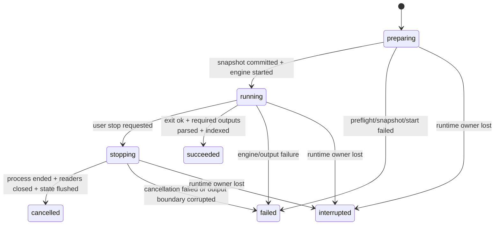

# 仿生大脑项目与运行架构

> 状态：架构提案，尚未实现。2026-10-10。
> 遵循 [Studio 架构宪法](../architecture.md)、[工作空间系统](../features/workspace-system.md) 与 [仿生大脑产品设计](../features/bionic-brain.md)。

## 结论

仿生大脑是现有本地 Workspace 中的一个领域目录和一组 Workbench Tab，不是第二种 Workspace、第二套 Agent runtime 或独立桌面应用。

架构只新增三个领域 owner：

- `BrainProjectRepository` 唯一拥有已保存的大脑项目文档、revision、引用和原子提交。
- `BrainSimulationService` 唯一拥有仿真进程、run 事件、运行终态和重启对账。
- 每个 run 目录中的 `record.json` 与不可变证据文件是实验记录事实源；记录列表只是可重建索引，不再建设第二运行账本。

renderer 只拥有选择、画布、时间游标、未保存草稿和查询投影。Engine adapter 只转换输入、启动固定引擎并解析输出，不拥有产品终态。Agent 和 Terminal 均不能写仿真事实。

首版只本地单机、一个固定 engine adapter、每个大脑项目最多一个活动 run、不排队。CCLink 登录、远程服务、芯片软件、云计算和任意脚本执行都不在依赖链中。

## 能力边界

### Studio 负责

- 项目与文档的受校验读写、revision、原子提交和冲突恢复。
- 模型解析、结构与动力学 preflight、运行输入快照和内容哈希。
- 固定引擎探测、进程生命周期、取消、输出解析、事实事件与诊断。
- 网络/矩阵可视化、真实活动回放、实验比较、复现和 HTS 导出。
- 复用 Workspace、Tab、Agent、Terminal、命令、快捷键、上下文操作和诊断基础设施。

### Studio 不负责

- 猜测缺失生物参数或把连接数静默变成突触权重。
- 用 renderer 数值积分、CSS 动画或 Agent 文本产生计算事实。
- 执行模型包中的任意 Python、shell、动态库或任意 executable。
- 云端仿真、队列、协作、芯片设计、忆阻器、RTL、FPGA、EDA、版图或硬件设备控制。
- 证明一个模型在未定义参考数据和判据时具有真实生物功能。

## 项目目录

```text
<existing-workspace>/
└── brain-projects/
    └── elegans-hermaphrodite/
        ├── brain-project.json              # 领域入口、范围、格式版本、对象索引
        ├── README.md                       # 研究目的、适用范围与复现说明
        ├── sources/
        │   ├── source-manifest.json        # DOI/URL、许可证、版本、原始哈希
        │   └── imported/                   # 复制进来的只读原始数据
        ├── structure/
        │   ├── neurons.*                   # 神经元与注释；实际大数据编码由 spike 决定
        │   ├── chemical-synapses.*         # 有向结构连接
        │   ├── electrical-synapses.*       # 规范化无向端点对
        │   └── structure-manifest.json     # 数量、覆盖、来源、校验摘要
        ├── circuits/
        │   └── <circuit-id>.circuit.json   # 稳定引用与选择规则，不复制网络对象
        ├── dynamics/
        │   └── <model-id>/
        │       ├── model.json              # 模型身份、层级、来源、binding 与兼容声明
        │       ├── model.nml               # 受支持时保存 NeuroML 2 原文
        │       └── includes/               # 受管理依赖；禁止越出项目根
        ├── experiments/
        │   └── <experiment-id>.experiment.json
        ├── activities/
        │   └── imported/
        │       └── <activity-id>/          # 外部实测/模拟数据与来源；不伪装成 Studio run
        ├── runs/
        │   └── <run-id>/
        │       ├── record.json             # 唯一运行记录、事实状态、输出索引
        │       ├── events.jsonl            # append-only 事实事件
        │       ├── inputs/
        │       │   ├── manifest.json       # 所有输入的路径、ID、revision、哈希、来源
        │       │   └── snapshot/           # 自包含、终态后不可变的实际输入
        │       ├── generated/               # adapter 生成的受控引擎输入
        │       ├── outputs/
        │       │   ├── raw/                # 引擎原始输出
        │       │   ├── activity-index.json # 信号、单位、时间基准、分段和哈希
        │       │   └── normalized/         # 可有界读取的规范化活动块
        │       └── logs/                    # 受限、脱敏的引擎与 Studio 日志
        ├── comparisons/
        │   └── <comparison-id>.comparison.json
        ├── reports/                         # 人类/Agent 解释，只引用 run，不改原始证据
        └── exports/
            └── hardware-targets/
                └── <target-id>/             # 单向导出，不产生芯片项目对象
                    ├── hardware-target.json
                    ├── standard-stimuli.*
                    └── reference-results.*
```

星号扩展名是待测的存储选择，不是承诺。302 个结构节点本身可以用 JSON 表达，但连接、长时间活动、多变量和全量记录可能需要分块二进制；在 scale spike 前不锁定 Parquet、HDF5、Arrow 或自定义格式。

### 文件职责

| 文件域 | 唯一事实 | 可否编辑 | 页面 |
| --- | --- | --- | --- |
| `brain-project.json` | 项目范围、格式版本和稳定对象索引 | 通过 repository | 模型工作台 |
| `sources/` | 导入原件、来源、授权与哈希 | manifest 可追加；原件只读 | 工作台来源检查 |
| `structure/` | 指定结构 revision 的神经元和两类突触 | 受 revision 保护 | 模型工作台 |
| `circuits/` | 对结构对象的保存引用与角色 | 可编辑 | 模型工作台 |
| `dynamics/` | 方程、参数、单位、初态、bindings 与引擎兼容 | 受限编辑 | 模型工作台 |
| `experiments/` | 可编辑刺激、运行设置、记录量和判据 | 可编辑；不存运行终态 | 模型工作台 |
| `activities/imported/` | 外部活动数据及来源 | 原始只读，注释另存 | 两页均可引用 |
| `runs/` | Studio 管理运行的不可变输入、事件、终态和输出 | 仅服务写；终态后证据不可变 | 实验记录、回放 |
| `comparisons/` | 对固定 run 的比较定义 | 可编辑 | 实验记录 |
| `reports/` | 解释、备注和结论 | 可编辑 | 实验记录 |
| `exports/hardware-targets/` | 派生的计算契约与参考向量 | 重新导出新 revision | 实验记录 |

## 对象身份与关系

所有领域对象必须包含：

- 稳定 ID；
- `schemaVersion`；
- `revision`；
- 项目根相对路径；
- 来源和内容哈希（适用时）。

引用同时保存 `objectId + relativePath + expectedRevision`。路径负责定位，ID 防止同名误认，revision 防止静默使用旧依赖，内容哈希证明本次运行输入。重命名由 repository 事务更新引用；外部移动、软链接越界、ID 冲突或 revision 不匹配均 fail closed。

对象关系遵守以下不变量：

- 神经元和突触只属于一个结构 revision；回路只引用，不复制。
- 化学突触以有向 `preNeuronId/postNeuronId` 表示；电突触使用排序后的规范端点对，动力学 binding 可定义具体耦合语义。
- 模型可以按类型、神经元或连接覆盖参数，但最终 run 必须展开为无歧义 binding manifest。
- 实验引用一个回路 revision 和一个模型 revision，不拥有它们。
- 活动数据必须明确 `origin = simulated | measured | imported-simulation`，Studio 管理 run 只能产生 `simulated`。
- 行为输出必须引用显式 transducer/body/environment 链路；链路缺失时最多是 `neural-output` 或 `muscle-proxy`。
- 重跑产生新 run ID 和 `parentRunId`，任何历史 run 都不可被覆盖。

## 保存与可移植边界

大脑项目保存可共享科学输入和运行证据；Studio 通用现场仍由 WorkspaceState 管理。

| 内容 | 保存位置 | 原因 |
| --- | --- | --- |
| 项目、结构、模型、回路、实验 | 项目目录 | 可版本化、可共享 |
| run 输入、事件、原始/规范化输出 | 项目 `runs/` | 科学证据和复现 |
| Tab、面板、当前选中、画布缩放、时间游标 | WorkspaceState 或可丢缓存 | UI 投影，不是科学事实 |
| 求解器绝对路径、可执行探测、本机 Java/Python 环境 | 现有本机配置边界 | 不可移植，不进入项目 |
| 大图布局、缩略波形和搜索索引 | `userData` 领域缓存 | 可重建，不能成为唯一证据 |

大体积 run 可以由用户选择不提交 Git，但 UI 必须说明未共享输出会破坏完整复现。导出复现包时显式选择输入、证据和许可证允许的第三方内容，不自动上传。

## 运行状态与事实事件

### 状态机



不增加 `queued`：首版每项目一个活动 run，冲突直接拒绝。`succeeded` 只由 `BrainSimulationService` 在进程与输出门禁同时通过后写入。功能判据另记 `passed | failed | undefined`，不能改变 run 终态。

### 事实事件最小集合

- `run-created`
- `snapshot-committed`
- `engine-started`
- `engine-progress`（仅引擎提供真实模拟时间或完成量时）
- `output-discovered`
- `output-chunk-indexed`
- `stop-requested`
- `engine-exited`
- `outputs-validated`
- `run-finalized`

每条事件包含 run ID、workspace ID、brain project ID、sequence、时间、阶段和受校验 payload。renderer 可以丢事件后重新查询 `record.json` 和事件序列；不能靠前端计时器补齐进度。

### 快照与复现流程

1. `BrainProjectRepository` 校验 workspace、项目、回路、模型和实验 revision；保存草稿或要求用户明确采用草稿。
2. Preflight 展开最终 binding，检查单位、初态、刺激、记录变量、引擎特性和输出预算。
3. `BrainSimulationService` 创建 run staging 目录并写 `preparing`。
4. `SnapshotBuilder` 复制全部依赖，拒绝越界路径和递归软链接，计算哈希并再次核对 revision。
5. manifest 原子提交后，adapter 以固定 executable/entry point 和参数数组启动；不得拼 shell 字符串。
6. adapter 只产生受 schema 校验的事件和原始输出索引。原始 stdout/stderr 有大小限制并脱敏。
7. 引擎退出后，服务校验必需文件、时间轴、单位、数值有效性和哈希；规范化输出使用临时文件后原子提交。
8. 服务写唯一终态。输入、事件、generated 和 outputs 随后不可变；备注写入 `reports/`。
9. 重跑从旧 manifest 建立新 staging 目录；环境差异在启动前显示，并写入新记录。

固定输入保证可追溯，不承诺跨引擎、跨平台或浮点实现逐位一致。复现使用模型定义的数值容差。

## 可视化与仿真引擎边界

| 关注点 | 可视化/renderer | 主进程领域服务 | Engine adapter / 引擎 |
| --- | --- | --- | --- |
| 模型草稿 | 编辑和显示；持有 base revision | 校验并提交 | 不拥有 |
| 结构布局 | 计算可丢弃布局、筛选和聚合 | 提供受限查询 | 不拥有 |
| 运行启动 | 提交 command 和期望 revision | preflight、快照、建 run、生命周期 | 接收固定输入并计算 |
| 进度 | 显示事实事件或不确定状态 | 验证、排序和持久化事件 | 可选报告模拟时间/完成量 |
| 活动数据 | 按时间窗请求、降采样显示 | 校验索引、分段读取、限额 | 产生原始数值输出 |
| 网络着色 | 把同一 run/time/quantity 映射到样式 | 返回对应采样与缺失标记 | 不渲染 |
| 成功 | 只显示服务终态 | 唯一写入 `succeeded/failed/...` | 只报告退出与输出，不写产品状态 |
| 生物判据 | 显示已定义指标和结果 | 用固定算法计算并登记 | 不自行声称功能复现 |

网络动画帧必须可反查 `runId + activityDatasetId + quantity + t + sampleRange`。插值、降采样和颜色比例是展示元数据，并在 UI 可见；不得把插值帧保存为引擎观测。

## Owner 与并发

| 状态域 | 唯一 owner | 其他层 |
| --- | --- | --- |
| Workspace、Tab、Agent、Terminal | Studio 现有基础层 | 仿生大脑只持稳定引用 |
| 已保存大脑项目文档 | `BrainProjectRepository` | renderer 持 revision 草稿；冲突不覆盖 |
| 仿真进程、事件、终态、取消 | `BrainSimulationService` | adapter 执行，renderer 查询订阅 |
| 引擎探测与兼容能力 | 主进程固定 adapter registry | UI 显示 ready/degraded/unavailable/failed |
| 原始输出与规范化索引 | run 证据 + 服务校验 | renderer 有界读取，不反写 |
| 活动回放选择与布局 | renderer 投影 | 丢失可重建，不写运行事实 |
| 比较定义和报告 | `BrainProjectRepository` | 引用固定 run，不修改 run |

首版同一大脑项目只允许一个活动 run。不同项目是否允许并行必须等资源和取消 spike 后再决定，默认也串行，不建设全局队列。工作空间切换只切 UI 投影；活动 run 仍绑定创建时 workspace/project。窗口重建从主进程查询事实。

## 生命周期与降级

- 注册、IPC、子进程、文件 watcher 和输出 reader 都进入现有 runtime 声明并提供对称释放。
- 切换 Workspace 时解绑旧 renderer 订阅；旧事件不得进入新 Workspace。
- App 正常退出先请求停止并刷盘；等待时间受限。下次启动把失去进程 owner 的非终态对账为 `interrupted/runtime_owner_lost`，保留部分输出，不自动重启。
- 项目目录在活动 run 中被移动/删除时请求停止并记录 `project_root_lost`；不能改用同名新目录。
- 引擎缺失、Java/Python 环境不符、模型特性不支持、输出超预算或许可证未接受，只降级仿生大脑运行；Studio 其他本地能力继续可用。
- CCLink 缺配置、未登录、token 失效、网络离线或远程 Agent 故障不得改变大脑项目浏览和本地运行。

## 权限与安全

- renderer 不直接读 Node 文件或启动进程，全部通过共享 contract。
- main 校验 sender、workspace/project scope、稳定 ID、revision、路径、读取窗口和输出大小。
- 导入只接受首版 allowlist 中的声明式格式；模型包内脚本保持惰性文件，不自动执行。
- adapter 使用固定的受支持 executable 与参数构建器，不接受 workspace shell 命令。
- 子进程继承最小环境，不取得 Studio 凭证、CCLink token 或其他 Workspace 秘密。
- 这不是 OS 沙箱；因此首版仅运行用户明确打开且格式受支持的模型，任意第三方可执行模型后置。
- 不使用系统钥匙串；该领域不应产生新凭证。

## 共享契约草案

先定义共享 schema，再实现 main/preload/renderer。建议 contract 只覆盖：

- `openBrainProject(workspaceRef, projectRef)`
- `validateBrainProject(projectId, revision)`
- `queryBrainGraph(projectId, revision, query, limit)`
- `saveBrainDocument(projectId, document, expectedRevision)`
- `prepareSimulation(projectId, experimentId, expectedRevisions)`
- `startSimulation(preparationId)`
- `stopSimulation(projectId, runId)`
- `getSimulationRun(projectId, runId)`
- `subscribeSimulationEvents(projectId, runId, afterSequence)`
- `readActivityWindow(projectId, runId, signalIds, timeRange, pointBudget)`
- `compareSimulationRuns(projectId, runIds, comparisonDefinition)`
- `rerunSimulation(projectId, sourceRunId)`
- `exportReproductionBundle(projectId, runIds, options)`

通道、参数 schema、返回值、结构化错误和 disposer 来自同一声明源，不在 main/preload/renderer 重复手写。命令面板、工具栏、快捷键和上下文菜单调用同一 command ID 与领域 command。

HTS 进入后续里程碑时再增加单独的导出 contract；不能因为本文已经定义字段就在 M1 暴露空按钮或假导出。

## 错误模型

错误至少区分：

- `project_invalid` / `schema_unsupported`
- `reference_missing` / `path_outside_project`
- `revision_conflict` / `input_changed_during_snapshot`
- `structure_incomplete` / `dynamics_incomplete`
- `engine_unavailable` / `engine_incompatible`
- `run_already_active`
- `snapshot_failed` / `disk_full`
- `engine_start_failed` / `engine_failed` / `engine_timeout`
- `cancel_failed` / `runtime_owner_lost`
- `required_output_missing` / `output_parse_failed` / `output_non_finite`
- `activity_window_too_large`
- `comparison_incompatible`
- `evidence_hash_mismatch`

错误携带稳定分类、对象/run ID、阶段、可采取动作和脱敏诊断引用。UI 不解析 stdout 文本推断分类。

## 源码模块建议

以下仅在纵向闭环需要时建立，不预建空框架：

```text
src/
├── shared/bionic-brain/
│   ├── brain-project-types.ts
│   ├── brain-project-schema.ts
│   ├── brain-simulation-types.ts
│   └── bionic-brain-contract.ts
├── main/bionic-brain/
│   ├── brain-project-repository.ts
│   ├── brain-project-service.ts
│   ├── brain-model-validator.ts
│   ├── brain-snapshot-builder.ts
│   ├── brain-simulation-service.ts
│   ├── brain-activity-reader.ts
│   ├── bionic-brain-ipc.ts
│   └── engines/
│       ├── brain-engine-adapter.ts
│       └── <selected-engine>-adapter.ts
└── renderer/src/features/bionic-brain/
    ├── BionicBrainSidebar.tsx
    ├── BionicBrainWorkbenchTab.tsx
    ├── BrainModelWorkbench.tsx
    ├── ExperimentRecords.tsx
    ├── components/
    ├── bionic-brain-store.ts
    └── bionic-brain-contribution.ts
```

preload 复用现有 contract client；不得再建求解器专用高权限桥或第二 IPC 字符串清单。右键动作在统一 context action M1 约束下通过 contribution 注册，不创建领域专属菜单框架。

## Hardware Target Specification 边界

HTS exporter 读取一个固定 run 的输入 manifest、模型、回路、标准刺激和参考输出，生成新的不可变 export revision。它不能：

- 写入或回读芯片实现对象；
- 推断 RTL、bit width、器件、PDK、网表或版图；
- 把软件模型参数自动改写成忆阻器/晶体管参数；
- 因导出成功而把 run 标为功能复现。

导出器的 owner 仍是大脑领域的文档服务，输出只是普通可交换文件。未来芯片软件导入后由其自身 owner 管理生命周期和验证，两端通过 HTS ID、schema version 与内容哈希关联。

## 实施顺序与门禁

### E0：科学与引擎 spike，不算用户功能

- 冻结候选结构数据、c302/NeuroML 模型、许可证和版本。
- 在命令行跑通局部回路、取消、失败、输出解析和重跑。
- 测 20–40 神经元、302 单室和记录密度的时间/内存/输出。
- 定义首个参考刺激、输出变量和可接受的数值重复容差。

退出：能给出真实产物与测量；否则停止 UI 扩张并更换模型或引擎。

### M1：最小纵向闭环

只实现打开固定参考项目、检查、保存回路、一个刺激类型、一个引擎、运行、回放、记录、两 run 对比和固定输入重跑。实现顺序沿用户动作纵切，不先完成通用导入器、全图编辑器或 HTS。

退出：产品文档的真人验收动作全部通过，同时受影响 smoke/`pnpm verify` 通过。

### M2 以后

根据失败证据扩展外部 NeuroML 导入、完整网络规模、实测活动数据、功能判据和 HTS。多引擎、扫描、云计算、身体/环境模型分别重新设计；不因目录已有位置自动进入范围。

## 架构拷问

- **唯一 owner 是否真的唯一？** 如果 renderer store、adapter 或 Agent 能直接写 run 终态，方案失败。
- **完整结构能否被误看成完整功能？** 页面必须同时显示结构层级、动力学层级和功能层级，且默认不合并徽标。
- **无真实进度怎么办？** 显示运行中和已知事实，不制造百分比。
- **全量活动能否拖垮 renderer？** 只允许时间窗和 point budget 查询；布局与回放降采样不能改原始证据。
- **引擎安装会不会越过暂停的 Runtime 组件边界？** 会有风险。若首版需要由 Studio 下载/更新 Java、jNeuroML 或 NEURON，实施前必须复审现有 Runtime 组件冻结条件并按需要提交 ADR；首版设计不能偷偷加入通用下载器。
- **取消能否真的结束？** 必须等进程退出、reader 结束和记录刷盘；只关 UI 或断 stdout 不能写 `cancelled`。
- **模型包会不会执行恶意脚本？** 首版只解析 allowlist 声明式文件；需要脚本生成的模型必须在外部生成后导入静态结果。
- **HTS 会不会重新污染领域？** 只要出现器件、RTL、版图或硬件运行状态，就已经越界。

## 当前最大风险与下一步

最大风险不是 302 节点图怎么画，而是候选模型的生物依据、运行环境和输出语义没有被实测冻结。下一步应先完成 E0 spike；没有 E0 证据，不应把模型画布、文件 Schema 数量或 mock 完成度写成产品进度。
