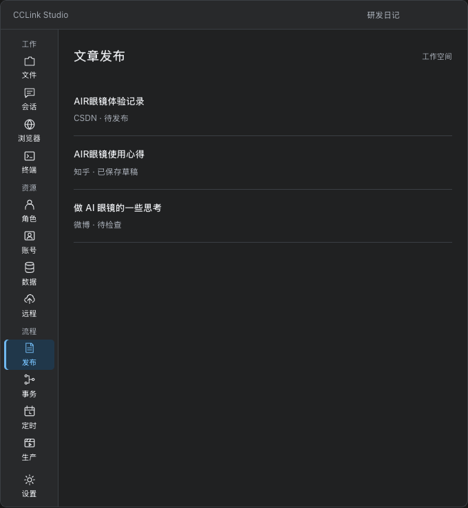
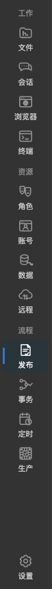
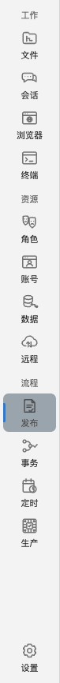
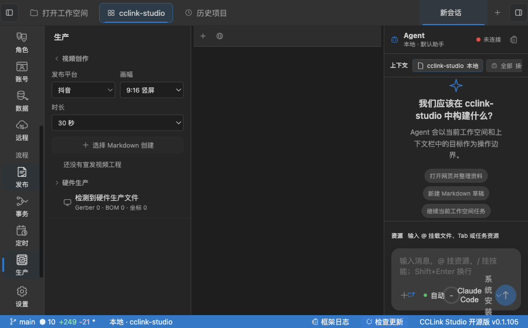

# Activity Bar · 图标下加短标签

2026-10-08。用户选定的方案：保留窄导航，在每个图标下常驻显示名称。

## 保存的设计

[交互效果图](./navigation-preview.html)默认打开选定方案；另一文字导航仅保留作设计对照，不实现。
可编辑来源为 `navigation.fragment.html`。这是设计示意，不是实际应用截图。

## 实现范围与验收动作

1. 启动源码版 Studio，无需悬停即可读到「工作 / 资源 / 流程」以及全部入口名称。
2. 点击「账号」进入原「网站与账号」，点击「发布」进入原「文章发布」；选中状态清晰。
3. 点击「生产」可找到视频创作；本轮仅调整导航，不新增视频能力。
4. 将工作区缩至约 900 × 560，在导航区域滚轮滚动后仍能点到「生产」，底部「设置」常驻。
5. 点击「设置」正常打开设置页；「文件」的右键和 Shift+F10 继续使用统一上下文菜单。
6. 切换浅色/深色均能阅读；打开内嵌网页，浏览器原生视图不覆盖导航或顶部工具栏。

导航宽 76px，按钮高 48px，图标 22px，标签 11px。长名称继续保留完整 tooltip 与无障碍名称，
Terminal 保留兼容名称，视觉标签显示「终端」。定时任务计数移至右上角，避免压住标签。

这是纯 renderer 呈现调整：仍由现有 UI/Tab store 拥有导航状态，不新增 IPC、权限、持久化或菜单 owner。
短窗口降级为导航滚动；设置在滚动区外。浏览器 bounds 与缩放继续由现有 BrowserManager 拥有。

## 验证证据

真实 Electron 开发实例通过 `pnpm smoke:ui --activity-bar-only`：13 个入口、分组和文字、宽度预留、
点击选中、滚轮滚动、设置、右键/键盘菜单、浅深色截图及真实原生浏览器布局。
测试使用隔离的本地工作区设置与本地网页，不涉及真实账号登录、模型调用或公开发布。

工程门禁：相关 6 项单元测试、web 类型检查、相关文件 ESLint、脚本语法检查与 diff 空白检查通过。
不声称完整全量回归或正式版本已发布；本轮未覆盖非零定时任务计数的真实运行状态。

## 当前查看方式

本次另外启动了隔离数据的源码预览，未关闭正在运行的安装版，也未更改正式用户数据。
如需重开预览：`pnpm smoke:ui --activity-bar-only --keep-running`。
普通 `pnpm dev` 与安装版共用单实例保护；要使用正式工作区数据查看源码版，先自行退出安装版再启动。
