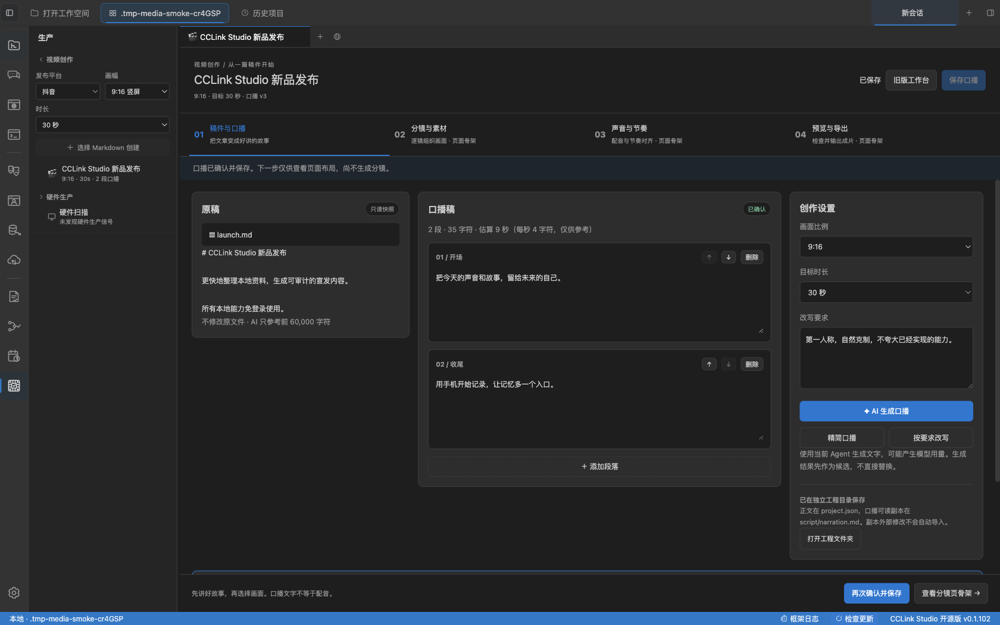
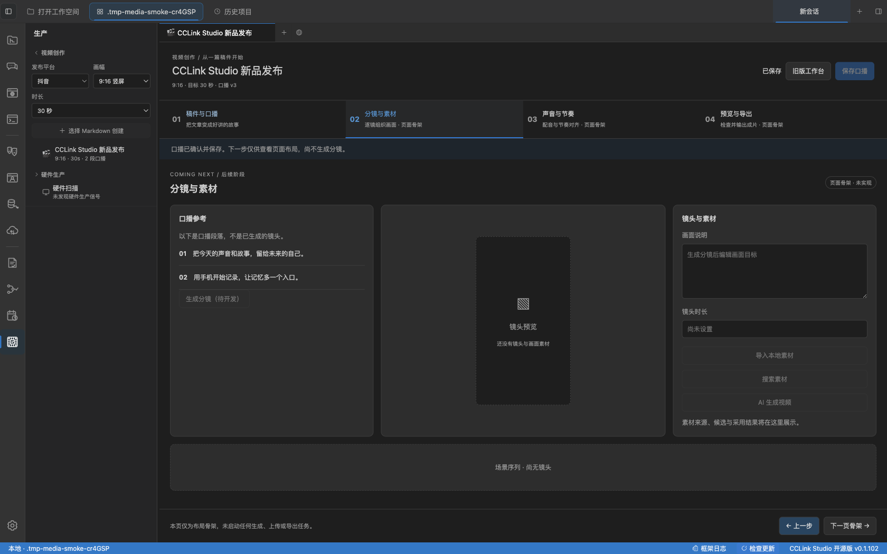
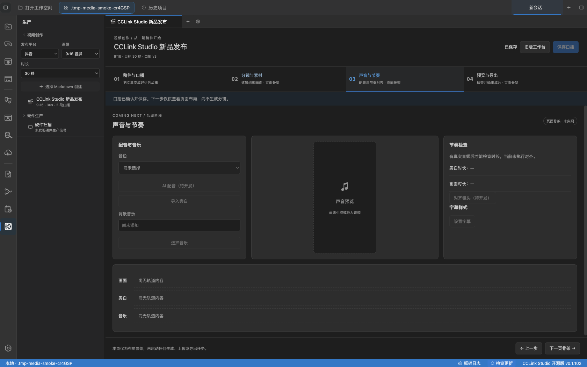
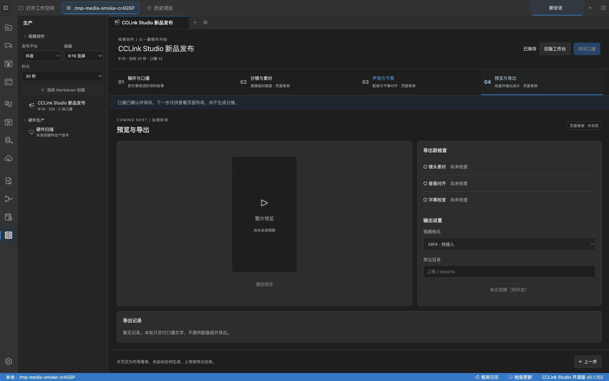
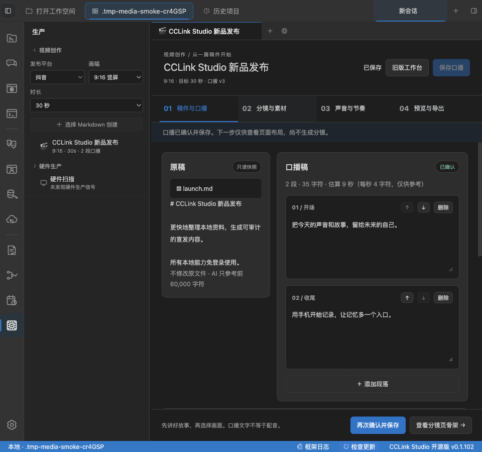

# 视频创作 · 首步实现与后三页骨架

2026-09-29，以下为真实 Electron 测试实例截图，不是 AI 效果图。
正文与候选为测试数据，未调用真实模型。开发范围见 [首步计划](../../features/video-creation-step-one-plan.md)。

## 01 稿件与口播

原稿只读，独立口播可编辑、增删排序、保存、确认；AI 结果先进入候选区。

## 02 分镜与素材 · 仅骨架

显示口播参考和空画面区；没有实际分镜、素材搜索或生成任务。

## 03 声音与节奏 · 仅骨架

配音、音乐、对齐和时间线均为明确占位，不生成声音。

## 04 预览与导出 · 仅骨架

空播放器、未检查状态、无导出记录；没有实际合成和导出。

## 窄窗口

布局随工作台宽度换行，内容区域可滚动，不横向挤出面板。

