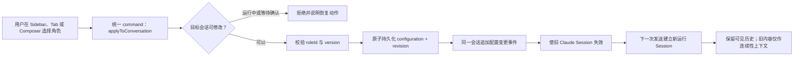
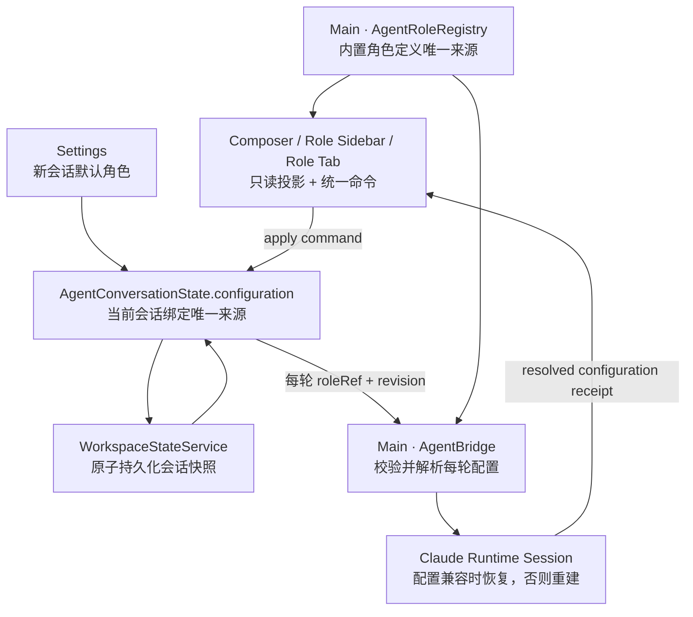

# Agent 角色中心与会话配置

> 状态：产品与架构方案已确认，正在实现。
>
> 最后更新：2026-07-31。
>
> 关联文档：`docs/architecture.md`、`docs/features/agent-profiles.md`、
> `docs/features/agent-system.md`、`docs/features/context-action-system.md`。

2026-07-31 已确认以下产品决策：切换角色保留同一用户会话和完整可见历史，但重建内部
Runtime Session；第一阶段只读内置角色定义，不开放自定义 prompt；只提供全局“新会话
默认角色”，暂不增加工作空间级默认值。

## 结论

角色应该是**会话配置**，不是切换整个会话的理由。

用户在已有消息的会话中更换角色时，保留同一个会话 ID、可见历史、草稿、挂载资源和
Workbench Tab；只更新该会话的角色配置。为避免旧角色污染后续执行，主进程使该会话
当前 Claude SDK Session 失效，下一条消息在同一个用户会话内建立新的运行 Session，
并把旧历史作为低优先级连续性上下文提供。

第一阶段仍只支持七个内置角色，不开放自定义 prompt、角色市场或多角色讨论，但增加
完整的角色工作台入口：

```text
Activity Bar「角色」
  -> 角色 Sidebar 列表
      -> Workbench「角色配置」Tab
          -> 应用到当前会话 / 设为新会话默认角色

Composer 当前角色 Chip
  -> 快速选择
      -> 与角色配置 Tab 调用同一个会话配置命令
```

这三个入口不是三套状态：角色定义由主进程注册表拥有，会话绑定由
`AgentConversationState.configuration` 唯一拥有，Sidebar、Tab 和 Composer 都只是投影
和命令入口。

## 已知问题与判断

`v0.1.14` 的静态代码链路已经做到：

- `profileRef` 存在于 renderer 会话状态；
- 工作空间快照会序列化和恢复 `profileRef`；
- 每次发送 payload 都携带 `profileRef`；
- 主进程解析角色并向 Claude Agent SDK 提交 system prompt append；
- Session 兼容指纹包含角色 ID 和版本。

但这还不能证明“第二次发送继续使用同一角色”。当前自动化只检查过单次 system prompt
注入，没有覆盖同一会话的连续两次 send，也没有给每轮运行返回主进程实际解析后的配置
回执。异机体验表明，至少存在以下一种失败：

1. UI 引用仍在，但恢复 Claude Session 后角色 system prompt 的实际行为没有延续；
2. 某个状态恢复或事件对账把 renderer 的角色引用回退为默认值；
3. 角色引用持续存在，但 prompt 强度不足，模型第二轮表现退化；
4. 产品只显示“已选择角色”，却没有可观察证据证明本轮运行采用了该配置。

因此下一步不能只增加更多入口。必须先把“持久引用”“本轮实际配置”和“模型行为评估”
拆成三个可分别验证的层次。

## 用户端到端验收

方案完成后，用户必须能在真实应用中完成以下动作：

1. 点击 Activity Bar 的“角色”，在 Sidebar 看到七个内置角色和当前会话角色。
2. 点击“公共治理者”，在 Workbench 打开唯一的“角色配置 · 公共治理者”Tab。
3. 点击“应用到当前会话”，当前会话不新增、不分叉，原消息、草稿和资源保持不变。
4. 在同一会话连续发送两次消息，两次运行回执都显示“公共治理者 v1”，输出持续体现该
   角色关注点。
5. 在已有历史的同一会话改为“公民权利倡导者”，时间线出现配置变更分隔，下一次发送
   使用新的运行 Session，但用户仍停留在原会话和原 Tab。
6. 重启 Studio，再发送第三条消息；角色选择、配置版本和本轮运行回执仍一致。
7. 将“事实核查员”设为新会话默认角色；现有会话不变化，新建会话默认使用该角色。
8. 切换角色前后，权限模式、操作 Scope、Runtime、工具授权和外部提交确认均不变化。
9. 角色版本不可用或配置保存失败时，界面明确阻止发送或回滚，不静默降级为默认助手。

只有引用、运行回执和真实行为三层都通过，才能声明角色持久化完成。

## 产品概念

| 概念           | 用户含义                                  | 状态所有者                             |
| -------------- | ----------------------------------------- | -------------------------------------- |
| 角色定义       | 一个可复用的职责、关注点和行为边界        | 主进程 `AgentRoleRegistry`             |
| 会话配置       | 当前会话以后由哪个角色处理                | `AgentConversationState.configuration` |
| 新会话默认配置 | 新建会话时默认选哪个角色                  | 现有 Settings 状态所有者               |
| 用户会话       | 用户看到的消息、资源、草稿和任务历史      | Agent conversation domain              |
| 运行 Session   | Claude SDK 为连续上下文维护的内部 Session | 主进程 Agent runtime                   |
| Skill          | 某次任务采用的流程                        | 现有 Skill / mounted skill 边界        |
| 权限           | Agent 实际能做什么                        | 现有权限系统和主进程硬边界             |

最重要的边界是：**切换角色不切换用户会话，但必须切换不兼容的运行 Session。**

## UI 设计

### 整体布局

```text
┌────┬──────────────────────┬──────────────────────────────────────────────┐
│活  │ 角色                 │ 角色配置 · 公共治理者                       │
│动  │                      │                                              │
│栏  │ 当前会话             │ [图标] 公共治理者   内置 · v1               │
│    │  政策讨论            │ 从公共利益、执行成本和制度约束分析          │
│会话│  ✓ 公共治理者 v1     │                                              │
│角色│                      │ [应用到当前会话] [设为新会话默认角色]       │
│文件│ 内置角色             │ 目标会话：政策讨论 · 当前工作空间           │
│浏览│  默认助手            │                                              │
│…   │  反方挑战者          │ 职责 / 分析清单 / 行为边界 / 示例           │
│    │  事实核查员          │                                              │
│    │  产品负责人          │ 该角色不能改变权限、Scope、Runtime 或确认面 │
│    │  技术架构师          │                                              │
│    │  公共治理者       ✓  │                                              │
│    │  公民权利倡导者      │                                              │
└────┴──────────────────────┴──────────────────────────────────────────────┘
```

### Activity Bar

- 在“会话”下方增加“角色”按钮，因为角色与 Agent 会话最相关。
- 内部面板 ID 使用 `agent-roles`，不能使用裸 `profiles`，避免与 Browser Profile 混淆。
- 点击采用现有 Activity 行为：切换或收起 Sidebar，不直接修改当前会话。
- 第一阶段不增加角标、通知或右键菜单。

### 角色 Sidebar

Sidebar 分为两部分：

1. **当前会话**：显示会话标题、工作空间、实际绑定角色和版本。
2. **内置角色**：显示七个角色的图标、名称和一句话职责。

行的两种状态必须视觉分离：

- “已打开”表示 Workbench 正在查看这个角色；
- “已应用”表示当前会话真正使用这个角色。

点击角色行只打开或聚焦角色配置 Tab，不立即应用，避免浏览详情时意外改变 Agent 行为。
当前应用角色使用勾选标识；新会话默认角色使用独立的“默认”文字标识，不能只靠颜色。

第一阶段角色只有七个，不增加搜索、分类、收藏和“新建角色”按钮。等开放自定义且数量
增长后再增加这些能力。

### 角色配置 Tab

Tab 类型为 `agent-role`，同一 `roleId@version` 全局只打开一个；它不属于某个工作空间，
但所有“应用”动作必须明确显示当前目标会话和工作空间。

Tab 展示：

- 名称、图标、内置标识和版本；
- 一句话职责；
- 适用目标与不适用场景；
- 分析或执行清单；
- 行为边界和安全说明；
- 两个可验证的输入/输出关注点示例；
- “应用到当前会话”；
- “设为新会话默认角色”。

第一阶段“配置”指配置角色的**使用关系**，不允许编辑内置定义或原始 system prompt。
角色定义内容以结构化字段透明展示，实际 system prompt 仍由主进程编译，renderer 不得
提交 prompt 文本。

“应用到当前会话”按钮应写出目标，例如：

```text
应用到「政策讨论」
```

若用户切换了工作空间或活动会话，按钮目标同步更新。点击时必须重新读取目标会话，不能
使用 Tab 打开时捕获的陈旧 conversation ID。

### Composer 当前角色

Composer 仍保留角色 Chip，因为发送前必须持续看见“谁在处理”。左侧角色中心用于发现
和理解，Composer 用于快速确认和切换，二者不能互相替代。

点击 Chip 打开紧凑菜单；选择角色时调用与配置 Tab 相同的
`agentRole.applyToConversation` 命令：

- 空会话：原地修改配置；
- 有历史会话：仍然原地修改配置，不再创建新会话；
- 正在运行或等待确认：暂时禁用，说明需要先完成、中止或处理确认；
- 应用成功：时间线显示配置变更分隔；
- 应用失败：选择态不变化并显示可恢复错误。

## 角色切换语义



切换时保留：

- conversation ID、标题和归档状态；
- 可见消息历史；
- 未发送草稿；
- 已挂载资源和 Skill；
- 工作空间、Surface 和 Workbench Tab；
- 权限模式、Scope 与 Runtime 选择。

切换时失效：

- Claude SDK session ID；
- 旧会话配置指纹；
- 与旧 Session 绑定的上下文用量快照；
- 只对旧角色成立的运行中派生状态。

时间线不伪造用户或助手消息，新增结构化事件：

```ts
interface AgentConversationConfigurationEvent {
  id: string
  type: 'configuration-changed'
  fromRoleRef: AgentRoleRef
  toRoleRef: AgentRoleRef
  configurationRevision: number
  timestamp: number
}
```

显示为：

```text
── 角色已从「公共治理者」切换为「公民权利倡导者」；后续消息使用新配置 ──
```

## 数据模型

新增命名使用 `AgentRole`，不继续扩散 `AgentProfile`。Browser Profile 继续专指浏览器登录
隔离，两者在类型、IPC 和诊断字段中都必须可区分。

```ts
interface AgentRoleRef {
  roleId: string
  version: number
}

interface AgentConversationConfiguration {
  schemaVersion: 1
  roleRef: AgentRoleRef
  revision: number
  updatedAt: number
}

interface AgentConversationState {
  // 其他会话字段保持不变
  configuration: AgentConversationConfiguration
  configurationEvents: AgentConversationConfigurationEvent[]
}
```

角色定义由主进程拥有：

```ts
interface BuiltinAgentRoleDefinition {
  ref: AgentRoleRef
  label: string
  description: string
  icon: AgentRoleIcon
  goals: string[]
  checklist: string[]
  boundaries: string[]
  examples: AgentRoleExample[]
  compilerTemplateKey: string
}
```

renderer 通过 IPC 只读取可展示描述。主进程从同一角色定义编译 system prompt，避免 UI
说明与真实行为形成两份事实源。

新会话默认配置写入现有 Settings：

```ts
interface AgentRoleSettings {
  defaultRoleRef: AgentRoleRef
}
```

它只影响之后创建的会话，不追改现有会话。

## 状态所有权与持久化



边界规则：

- `AgentRoleRegistry` 只拥有定义，不拥有“当前选中角色”。
- `AgentConversationState.configuration` 是会话绑定的唯一持久状态。
- `AgentBridge` 的角色 Map 只能是当前进程的派生运行缓存，不能接受独立修改，也不能在
  renderer 缺字段时静默回退默认角色。
- 角色变更使用显式异步 command，并立即调用原子持久化，不依赖普通消息更新顺带落盘。
- 持久化失败时回滚 UI 配置且不重置运行 Session，不能显示“已应用”。
- 快照恢复时无效版本保持为 `unavailable`，提示用户迁移；不得静默替换为默认助手。

## 每轮运行配置与可观测性

发送 contract 不再只传可选 `profileRef`，而是传完整且必填的会话配置引用：

```ts
interface AgentConversationRunConfiguration {
  roleRef: AgentRoleRef
  configurationRevision: number
}
```

主进程校验后自行计算：

```text
configurationFingerprint = hash(
  runtimeCompatibilityFingerprint
  + roleId
  + roleVersion
  + configurationRevision
  + promptCompilerVersion
)
```

主进程为每个 run 发出不含 prompt 正文的回执：

```ts
interface AgentRunConfigurationReceipt {
  conversationId: string
  runId: string
  roleRef: AgentRoleRef
  configurationRevision: number
  configurationFingerprint: string
  runtimeSessionMode: 'new' | 'resumed'
}
```

第二次发送的正确条件不是“模型语气看起来相似”，而是：

1. renderer payload 仍引用同一配置 revision；
2. main 回执解析为同一角色和指纹；
3. Session mode 为 `resumed`；
4. backend 本轮实际 options 中仍包含编译后的角色系统指令；
5. 真实行为样例仍满足该角色的评估标准。

如果角色改变，下一轮必须是新指纹且 `runtimeSessionMode = 'new'`。主进程发现 renderer 提交
的配置与当前可恢复 Session 不匹配时必须拒绝恢复旧 Session，不能把旧 Session 与新
角色混用。

## IPC 与命令

角色中心至少需要以下只读 IPC：

```text
agentRole.list
agentRole.get
```

会话配置变更不新增第二个 Store，通过 Agent conversation domain 的显式命令完成：

```text
agentRole.openDetail
agentRole.applyToConversation
agentRole.setDefaultForNewConversations
```

Composer、Sidebar 和配置 Tab 必须引用同一 command ID、可用条件和执行入口。第一阶段
不添加独立右键菜单；未来若增加，必须通过统一上下文操作系统注册。

## 版本与迁移

现有快照：

```ts
profileRef: {
  ;(profileId, version)
}
```

迁移后：

```ts
configuration: {
  schemaVersion: 1,
  roleRef: { roleId: profileId, version },
  revision: 1,
  updatedAt,
}
```

采用一版双读、单写新格式：

- 读取新 `configuration`；不存在时读取旧 `profileRef` 并迁移；
- 新快照只写 `configuration`；
- IPC 兼容层短期接受旧字段，但进入主进程前归一化为 `AgentRoleRef`；
- 兼容期结束后删除 `AgentProfileRef`，不能永久维护两个字段。

每个会话固定角色版本。升级内置角色时保留当前支持期内的历史版本，或在配置 Tab 显示
明确的“升级到 vN”操作；不得静默改写已存在会话的角色行为。

## 失败降级

| 失败                    | 用户表现                      | 系统行为                           |
| ----------------------- | ----------------------------- | ---------------------------------- |
| 角色列表加载失败        | 角色 Sidebar 显示不可用及重试 | 其他工作台能力继续可用             |
| 当前角色版本缺失        | 会话显示“角色不可用”          | 阻止发送，提供显式迁移             |
| 配置持久化失败          | 应用操作失败，原角色保持      | 不重置 Session，不伪装成功         |
| 切换时 Agent 正在运行   | 按钮禁用并说明原因            | 不修改配置；用户可先中止           |
| 运行回执与 UI 不一致    | 本轮停止并显示诊断错误        | 不继续生成或静默降级               |
| 新角色 Session 创建失败 | 原历史和配置保留，可重试      | 不恢复旧角色 Session               |
| Registry 初始化失败     | Agent 角色能力 degraded       | Browser、Editor、Terminal 不受影响 |

## 实现顺序

### C1：先修连续发送与持久化闭环

- 引入 `AgentConversationConfiguration` 和迁移。
- 同一角色连续两次发送，记录并校验运行配置回执。
- 角色配置变更立即原子持久化。
- 修正“已有历史就创建新会话”为“同会话配置变更 + 运行 Session 重建”。

用户增量：用户能在同一会话稳定使用或切换角色，第二次发送和重启后仍生效。

### C2：角色中心 UI

- Activity Bar 增加 `agent-roles`。
- Sidebar 增加当前会话卡片和七个内置角色列表。
- Workbench 增加 `agent-role` Tab 与角色详情。
- Composer、Sidebar、Tab 接入统一命令。

用户增量：用户能集中发现、理解和应用角色，且始终知道当前会话实际使用哪个角色。

### C3：默认角色、版本和失败体验

- 增加新会话默认角色设置。
- 增加角色版本不可用和显式升级路径。
- 完成恢复、失败回滚、诊断复制和异机真实验收。

用户增量：角色配置在长期使用、升级和异常场景下仍可解释、可恢复。

第一阶段不做：

- 用户自定义角色或编辑 system prompt；
- 角色导入导出、市场或云同步；
- 一个会话同时激活多个角色；
- 角色自动协商、辩论或汇总；
- 角色改变模型、Runtime、权限或工具 Scope；
- 根据消息内容自动切换角色。

## `/grilling` 结论

### 已确认的方向

1. 角色是会话配置，不是会话本身，也不是 Skill。
2. 切换角色不创建新用户会话，但必须隔离不兼容的 Claude Runtime Session。
3. Activity、Sidebar、配置 Tab 和 Composer 必须共享一个配置命令和一个状态所有者。
4. 第一阶段配置 Tab 管理“应用关系”和“新会话默认值”，不编辑内置角色定义。
5. 连续发送的主进程运行回执是持久化验收的一部分，不能继续只凭 UI 勾选态判断。

### 已确认的产品取舍

1. **历史保留方式**：同一会话完整保留可见历史，但切换后新建内部 Runtime
   Session；旧历史只作为连续性上下文，不重新伪装成新角色的原生历史。
2. **配置 Tab 的编辑范围**：第一阶段只读角色定义，仅允许“应用到当前会话”和
   “设为新会话默认角色”；自定义角色另立里程碑。
3. **默认角色作用域**：只设一个全局“新会话默认角色”，现有会话继续使用各自
   配置；暂不增加工作空间级默认值，避免三层继承关系。

### 最容易失败的地方

- 只做左侧三个入口，没有先修第二次发送的运行事实；
- 同一会话切换角色时继续 resume 旧 SDK Session；
- 为 Sidebar、Tab、Composer 分别维护 selected role；
- 角色配置 Tab 看似可编辑，实际修改不能进入主进程 prompt；
- 持久化失败仍更新 UI，让用户误以为配置已保存；
- 把角色能力与权限、Scope 或 Runtime 绑定，扩大授权面；
- 同时保留 `profileRef` 和 `configuration.roleRef` 成为两个长期状态所有者。

下一步最该先完成 C1，而不是先铺完整角色管理 UI。只有“同一会话连续两次发送、切换
角色不分叉、重启后第三次发送”在真实应用中形成闭环，Activity、Sidebar 和配置 Tab
才是在呈现可靠能力，而不是放大一个仍不稳定的选择器。
