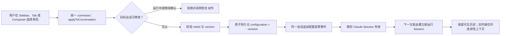
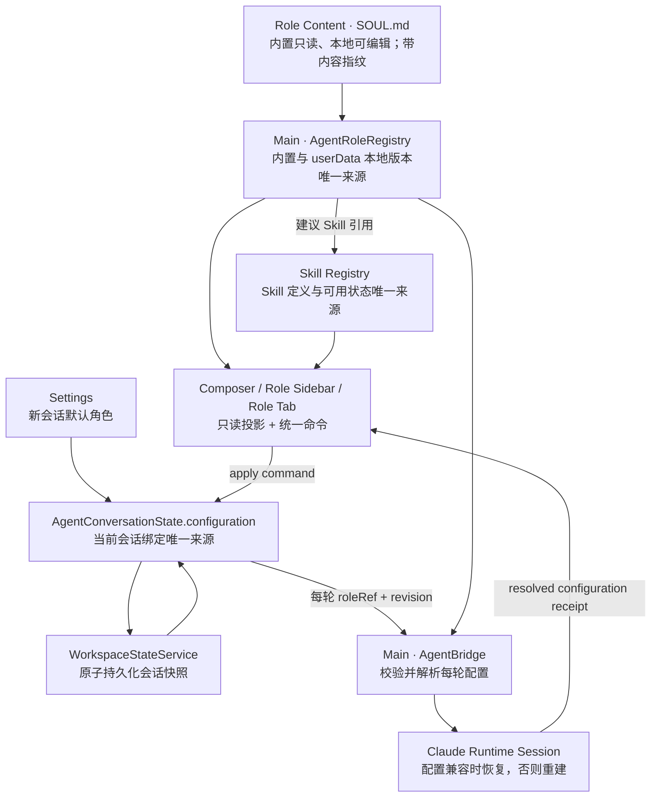

# Agent 角色中心、会话配置与角色内容模型

> 状态：R0-R4 研发候选已贯通。角色中心、七个内置角色、版本化 Skill、`userData` 本地
> 自定义角色、不可变版本、归档恢复、角色包导入导出与显式升级/回滚均已实现；自动化门禁
> 通过后仍需在最终安装包执行同会话连续运行、重启恢复和跨机器导入的真人验收。
>
> 最后更新：2026-08-13。
>
> 关联文档：`docs/architecture.md`、`docs/features/agent-profiles.md`、
> `docs/features/agent-system.md`、`docs/features/context-action-system.md`。

已确认以下产品决策：切换角色保留同一用户会话和完整可见历史，但重建内部 Runtime
Session；中间 Workbench 全局只保留一个“角色配置”Tab，点击左侧列表只切换这个 Tab
正在查看的角色；内置角色只读且可复制，本地角色在同一 Tab 编辑并以不可变版本保存；只提供
全局“新会话默认角色”，暂不增加工作空间级默认值。

角色内容扩展也已定稿：角色由结构化 Manifest、可选 `SOUL.md` 和建议 Skill 引用共同描述。
`SOUL.md` 负责身份、价值取向、表达方式和长期行为原则；Skill 负责可复用流程。二者都不能
扩大工具权限、绕过确认或成为第二份会话配置。

## 结论

角色应该是**会话配置**，不是切换整个会话的理由。

用户在已有消息的会话中更换角色时，保留同一个会话 ID、可见历史、草稿、挂载资源和
Workbench Tab；只更新该会话的角色配置。为避免旧角色污染后续执行，主进程使该会话
当前 Claude SDK Session 失效，下一条消息在同一个用户会话内建立新的运行 Session，
并把旧历史作为低优先级连续性上下文提供。

当前实现支持七个内置角色和本机自定义角色，不开放角色市场、云同步或多角色讨论，并提供
完整的角色工作台入口：

```text
Activity Bar「角色」
  -> 角色 Sidebar 列表
      -> Workbench「角色配置」Tab
          -> 应用到当前会话 / 设为新会话默认角色

Composer 当前角色 Chip
  -> 快速选择
      -> 与角色配置 Tab 调用同一个会话配置命令
```

这些入口不是多套状态：角色定义由主进程注册表拥有，会话绑定由
`AgentConversationState.configuration` 唯一拥有，Sidebar、Tab 和 Composer 都只是投影
和命令入口。

角色也不是“AI 员工”的轻量命名。已确认采用“领域上分离，产品上组合，交付上保持一个
Studio”：角色是可复用人格模板；员工是未来可能引用角色、资源和能力并被持续分配工作的
执行主体。普通会话可直接使用角色，一个角色也可被多个员工引用；AI 员工当前暂停，不进入
本角色里程碑，完整边界见 `docs/features/ai-employees.md`。

## 产品范围定稿

角色中心解决四个不同问题，必须在同一配置页中呈现，但不能混成一个状态对象：

| 层次          | 回答的问题                           | 是否随角色应用           | 是否改变权限 |
| ------------- | ------------------------------------ | ------------------------ | ------------ |
| 角色 Manifest | “这是谁、负责什么、有哪些边界？”     | 是                       | 否           |
| `SOUL.md`     | “长期坚持什么原则、以什么方式表达？” | 是                       | 否           |
| 建议 Skill    | “处理此类任务时可采用哪些流程？”     | 否；用户明确挂载后才生效 | 否           |
| 会话配置      | “这个会话当前使用哪个角色版本？”     | 本身就是应用关系         | 否           |

当前已交付角色 Manifest、`SOUL.md`、建议 Skill、会话应用关系、默认角色、运行回执、
Session 隔离以及本地角色的创建、编辑、不可变版本和角色包流转。所有定义仍在**同一个
配置页**查看或编辑，不新增角色级 Tab。

### 明确不做的隐式行为

- 浏览某个角色不等于应用角色。
- 展示建议 Skill 不等于自动安装或挂载 Skill。
- `SOUL.md` 不提供脚本、工具声明、权限声明或远程内容加载能力。
- 切换角色不改变模型、Provider、Runtime、权限模式、工具 Scope 或外部提交确认。
- 角色不是资源授权或员工配置；切换角色不能绑定账号、分配事务、启用定时任务或扩大能力。
- 配置页当前查看的角色不进入会话快照；只有用户点击“应用”后才修改会话配置。

## 历史问题与设计依据

`v0.1.14` 的静态代码链路已经做到：

- `profileRef` 存在于 renderer 会话状态；
- 工作空间快照会序列化和恢复 `profileRef`；
- 每次发送 payload 都携带 `profileRef`；
- 主进程解析角色并向 Claude Agent SDK 提交 system prompt append；
- Session 兼容指纹包含角色 ID 和版本。

但这还不能证明“第二次发送继续使用同一角色”。当时自动化只检查过单次 system prompt
注入，没有覆盖同一会话的连续两次 send，也没有给每轮运行返回主进程实际解析后的配置
回执。异机体验表明，至少存在以下一种失败：

1. UI 引用仍在，但恢复 Claude Session 后角色 system prompt 的实际行为没有延续；
2. 某个状态恢复或事件对账把 renderer 的角色引用回退为默认值；
3. 角色引用持续存在，但 prompt 强度不足，模型第二轮表现退化；
4. 产品只显示“已选择角色”，却没有可观察证据证明本轮运行采用了该配置。

因此后续设计不能只增加更多入口，必须把“持久引用”“本轮实际配置”和“模型行为评估”
拆成三个可分别验证的层次。V1 已据此补齐运行回执和相关自动化，异机真实行为仍按下文
验收标准确认。

## 用户端到端验收

### V1 角色与会话配置

用户必须能在真实应用中完成以下动作：

1. 点击 Activity Bar 的“角色”，在 Sidebar 看到七个内置角色和当前会话角色。
2. 点击“公共治理者”，在 Workbench 打开唯一的“角色配置”Tab；再点击其他角色时仍复用
   这个 Tab，只切换其中正在查看的角色。
3. 点击“应用到当前会话”，当前会话不新增、不分叉，原消息、草稿和资源保持不变。
4. 在同一会话连续发送两次消息，两次运行回执都显示“公共治理者 v1”，输出持续体现该
   角色关注点。
5. 在已有历史的同一会话改为“公民权利倡导者”，时间线出现配置变更分隔，下一次发送
   使用新的运行 Session，但用户仍停留在原会话和原 Tab。
6. 重启 Studio，再发送第三条消息；角色选择、配置版本和本轮运行回执仍一致。
7. 将“事实核查员”设为新会话默认角色；现有会话不变化，新建会话默认使用该角色。
8. 切换角色前后，权限模式、操作 Scope、Runtime、工具授权和外部提交确认均不变化。
9. 角色版本不可用或配置保存失败时，界面明确阻止发送或回滚，不静默降级为默认助手。

只有引用、运行回执和真实行为三层都通过，才能声明角色持久化完成。

### 角色内容、Skill 与本地角色扩展

Skill / `SOUL.md` 扩展完成后，用户还必须能完成：

1. 进入唯一的“角色配置”Tab，在左侧连续点击两个角色，Tab 数量保持为一个，页面内容
   原位切换且当前会话角色不变化。
2. 在角色配置页查看“角色概览、人格与原则、建议 Skills、行为规则、边界与版本”六类信息。
3. 展开 `SOUL.md` 的可读预览，清楚看到来源、内容摘要和内容指纹；页面不暴露隐藏 system
   prompt，也不执行 Markdown 中的脚本或远程引用。
4. 点击某个建议 Skill 的“挂载到当前会话”，Composer 出现对应 Skill；只浏览或切换角色
   时不得自动挂载、卸载或替换已有 Skill。
5. Skill 不可用时显示“未安装/不可用”与恢复入口；角色本身仍可使用，不静默假装 Skill
   已生效。
6. 应用角色后连续发送两次消息，运行回执中的角色版本和角色内容指纹一致；更新角色内容
   后下一轮必须创建新的内部 Runtime Session。
7. 切换角色或挂载 Skill 前后，权限模式、工具 Scope 和人工确认点完全不变。

以上动作通过前，只能称为“角色内容扩展候选”，不能称为 Skill / `SOUL.md` 支持完成。

## 产品概念

| 概念           | 用户含义                                   | 状态所有者                              |
| -------------- | ------------------------------------------ | --------------------------------------- |
| 角色 Manifest  | 角色身份、职责、关注点、版本和行为边界     | 主进程 `AgentRoleRegistry`              |
| `SOUL.md`      | 角色长期人格、原则、表达方式和自我约束     | 角色定义包；由 Registry 校验和编译      |
| 建议 Skill     | 适合该角色的流程建议，需用户明确挂载才生效 | 角色定义只持引用；Skill Registry 持定义 |
| 已挂载 Skill   | 当前会话或消息实际采用的流程               | Agent conversation / Composer domain    |
| 会话配置       | 当前会话以后由哪个角色处理                 | `AgentConversationState.configuration`  |
| 新会话默认配置 | 新建会话时默认选哪个角色                   | 现有 Settings 状态所有者                |
| 用户会话       | 用户看到的消息、资源、草稿和任务历史       | Agent conversation domain               |
| 运行 Session   | Claude SDK 为连续上下文维护的内部 Session  | 主进程 Agent runtime                    |
| 权限           | Agent 实际能做什么                         | 现有权限系统和主进程硬边界              |

最重要的边界是：**切换角色不切换用户会话，但必须切换不兼容的运行 Session。**

## UI 设计

### 整体布局

```text
┌────┬──────────────────────┬──────────────────────────────────────────────┐
│活  │ 角色                 │ 角色配置                                     │
│动  │                      │                                              │
│栏  │ 当前会话             │ [图标] 公共治理者   内置 · v1               │
│    │  政策讨论            │ 从公共利益、执行成本和制度约束分析          │
│会话│  ✓ 公共治理者 v1     │                                              │
│角色│                      │ [应用到当前会话] [设为新会话默认角色]       │
│文件│ 内置角色             │ 目标会话：政策讨论 · 当前工作空间           │
│浏览│  默认助手            │                                              │
│…   │  反方挑战者          │ 职责 / 分析清单 / 行为边界 / 示例           │
│    │  事实核查员          │                                              │
│    │  产品负责人          │ 该角色不能改变权限、Scope、Runtime 或确认面 │
│    │  技术架构师          │                                              │
│    │  公共治理者       ✓  │                                              │
│    │  公民权利倡导者      │                                              │
└────┴──────────────────────┴──────────────────────────────────────────────┘
```

### Activity Bar

- 在“会话”下方增加“角色”按钮，因为角色与 Agent 会话最相关。
- 内部面板 ID 使用 `agent-roles`，不能使用裸 `profiles`，避免与 Browser Profile 混淆。
- 点击采用现有 Activity 行为：切换或收起 Sidebar，不直接修改当前会话。
- 第一阶段不增加角标、通知或右键菜单。

### 角色 Sidebar

Sidebar 分为两部分：

1. **当前会话**：显示会话标题、工作空间、实际绑定角色和版本。
2. **内置角色**：显示七个角色的图标、名称和一句话职责。

行的两种状态必须视觉分离：

- “已打开”表示 Workbench 正在查看这个角色；
- “已应用”表示当前会话真正使用这个角色。

点击角色行只打开或聚焦唯一的角色配置 Tab，并切换该 Tab 正在查看的角色；不立即应用，
避免浏览详情时意外改变 Agent 行为。
当前应用角色使用勾选标识；新会话默认角色使用独立的“默认”文字标识，不能只靠颜色。

Sidebar 当前包含“我的角色”“内置角色”和可折叠的“已归档”三组，并提供“新建角色”与
“导入”入口。当前不增加搜索、分类和收藏；数量增长后再评估。

### 角色配置 Tab

Tab 类型为 `agent-role`，全局最多只能存在一个，不按 `roleId@version` 分页。Tab 内的
`agentRole` 引用只是“正在查看哪个角色”的瞬时界面状态；点击左侧角色行会原位更新它，
不会新建 Tab，也不会修改会话配置。该 Tab 不属于某个工作空间，但所有“应用”动作必须
明确显示当前目标会话和工作空间。

Tab 展示：

- **页头**：名称、图标、内置标识、版本、一句话职责，以及“应用到当前会话”和“设为
  新会话默认角色”。
- **角色概览**：目标、适用场景、不适用场景和可验证的输出关注点。
- **人格与原则**：`SOUL.md` 的安全 Markdown 预览、来源和内容指纹。
- **建议 Skills**：Skill 名称、用途、来源、可用状态和“挂载到当前会话”。
- **行为规则**：分析或执行清单。
- **边界与版本**：安全说明、角色标识、当前会话配置 revision 和最近运行回执。

这些内容采用一个页面内的连续分区，不为“概览 / SOUL / Skill”再创建 Workbench Tab，
也不为每个角色保存独立页面实例。左侧列表永远驱动同一个页面的查看目标。

“配置”同时覆盖角色的**使用关系**和本地角色结构化内容。内置定义及所有角色的原始编译
指令只读；本地角色可编辑公开 Manifest 字段和 `SOUL.md`，保存时由主进程校验并创建新版本。
实际 system prompt 仍由主进程编译，renderer 不得提交隐藏 prompt 文本。

内置 `SOUL.md` 只读，本地 `SOUL.md` 可编辑，但两者都不是 renderer 可直接编辑的完整
system prompt。配置页显示经过校验的 Markdown 和内容指纹，不显示编译器附加的隐藏安全指令。
建议 Skill 只提供显式挂载动作，不使用“已展示”冒充“已生效”。

“应用到当前会话”按钮应写出目标，例如：

```text
应用到「政策讨论」
```

若用户切换了工作空间或活动会话，按钮目标同步更新。点击时必须重新读取目标会话，不能
使用 Tab 打开时捕获的陈旧 conversation ID。

### Composer 当前角色

Composer 仍保留角色 Chip，因为发送前必须持续看见“谁在处理”。左侧角色中心用于发现
和理解，Composer 用于快速确认和切换，二者不能互相替代。

点击 Chip 打开紧凑菜单；选择角色时调用与配置 Tab 相同的
`agentRole.applyToConversation` 命令：

- 空会话：原地修改配置；
- 有历史会话：仍然原地修改配置，不再创建新会话；
- 正在运行或等待确认：暂时禁用，说明需要先完成、中止或处理确认；
- 应用成功：时间线显示配置变更分隔；
- 应用失败：选择态不变化并显示可恢复错误。

## 角色切换语义



切换时保留：

- conversation ID、标题和归档状态；
- 可见消息历史；
- 未发送草稿；
- 已挂载资源和 Skill；
- 工作空间、Surface 和 Workbench Tab；
- 权限模式、Scope 与 Runtime 选择。

切换时失效：

- Claude SDK session ID；
- 旧会话配置指纹；
- 与旧 Session 绑定的上下文用量快照；
- 只对旧角色成立的运行中派生状态。

时间线不伪造用户或助手消息，新增结构化事件：

```ts
interface AgentConversationConfigurationEvent {
  id: string
  type: 'configuration-changed'
  fromRoleRef: AgentRoleRef
  toRoleRef: AgentRoleRef
  configurationRevision: number
  timestamp: number
}
```

显示为：

```text
── 角色已从「公共治理者」切换为「公民权利倡导者」；后续消息使用新配置 ──
```

## 数据模型

新增命名使用 `AgentRole`，不继续扩散 `AgentProfile`。Browser Profile 继续专指浏览器登录
隔离，两者在类型、IPC 和诊断字段中都必须可区分。

```ts
interface AgentRoleRef {
  roleId: string
  version: number
}

interface AgentConversationConfiguration {
  schemaVersion: 1
  roleRef: AgentRoleRef
  revision: number
  updatedAt: number
}

interface AgentConversationState {
  // 其他会话字段保持不变
  configuration: AgentConversationConfiguration
  configurationEvents: AgentConversationConfigurationEvent[]
}
```

当前角色定义由主进程拥有，renderer 只获得公开摘要：

```ts
interface AgentRoleSummary extends AgentRoleRef {
  source: 'builtin' | 'local' | 'imported'
  archived: boolean
  isLatest: boolean
  label: string
  description: string
  icon: AgentRoleIcon
  goals: string[]
  suitableFor: string[]
  unsuitableFor: string[]
  instructions: string[]
  boundaries: string[]
  examples: AgentRoleExample[]
  contentHash: string
  recommendedSkillRefs: AgentSkillRef[]
  soul?: AgentRoleSoulSummary
  disclaimer?: string
}
```

renderer 通过 IPC 只读取可展示描述。主进程从同一角色定义编译 system prompt，避免 UI
说明与真实行为形成两份事实源。

本地角色写入时采用同构的公开 Draft；主进程补充稳定标识、版本、来源、时间和指纹：

```ts
interface AgentRoleDraft {
  label: string
  description: string
  icon: AgentRoleIcon
  goals: string[]
  suitableFor: string[]
  unsuitableFor: string[]
  instructions: string[]
  boundaries: string[]
  examples: AgentRoleExample[]
  soulMarkdown?: string
  recommendedSkillRefs: AgentSkillRef[]
}

interface AgentSkillRef {
  skillId: string
  version: number
}
```

`recommendedSkillRefs` 只保存稳定引用，不复制 Skill 文本。Skill 定义、安装状态和版本解析
由统一 Skill Registry 拥有；会话和角色只保存版本化引用，renderer 不提交 Skill 正文。

### `SOUL.md` 契约

`SOUL.md` 是角色定义的一部分，用于表达比结构化清单更连续的人格与原则。建议结构为：

```markdown
# Identity

## Purpose

## Principles

## Voice

## Boundaries
```

约束如下：

- 内置角色的 `SOUL.md` 随 App 发布并由主进程读取；renderer 只接收清洗后的可展示内容。
- 规范文件名为 `SOUL.md`；导入自定义角色包时兼容读取 `soul.md`，导出时统一规范名。
- Markdown 只允许文本语义，不执行 HTML、脚本、命令、插件声明或远程 include。
- `SOUL.md` 不能声明工具、权限、凭证、模型或 Provider；这类字段即使出现也必须被忽略并
  在诊断中提示。
- 内容大小、编码和解析失败必须有上限与明确错误；失败时不得退回一段未知旧 prompt。
- 进入运行时的是主进程编译结果。`contentHash` 必须进入角色内容指纹；内容变化后不得
  resume 使用旧角色内容的 Runtime Session。

自定义角色采用本地角色包流转，而不是允许任意工作空间文件自动成为人格：

```text
my-role/
├── role.json       # 结构化 Manifest 与 Skill 引用
└── SOUL.md         # 可选的人格与原则
```

导入先预览名称、版本、来源、内容指纹和 Skill 可用状态，再显式选择“更新为新版本、另存
副本或取消”。包 Schema 严格拒绝工具权限、凭证、Provider 和未知可执行字段。

新会话默认配置写入现有 Settings：

```ts
interface AgentRoleSettings {
  defaultRoleRef: AgentRoleRef
}
```

它只影响之后创建的会话，不追改现有会话。

## 状态所有权与持久化



边界规则：

- `AgentRoleRegistry` 只拥有定义，不拥有“当前选中角色”。
- `SOUL.md` 是角色定义的内容资源，不拥有应用关系，也不是设置文件。
- 角色 Manifest 只引用 Skill；Skill Registry 拥有定义和可用状态，会话拥有用户实际挂载的
  Skill。缺少 Skill 时不得把引用复制成一份角色内 Skill 定义。
- `AgentConversationState.configuration` 是会话绑定的唯一持久状态。
- 唯一角色配置 Tab 的 `agentRole` / `selectedRoleRef` 只属于 renderer 视图状态，不写入
  WorkspaceState，也不能覆盖 `AgentConversationState.configuration.roleRef`。
- `AgentBridge` 的角色 Map 只能是当前进程的派生运行缓存，不能接受独立修改，也不能在
  renderer 缺字段时静默回退默认角色。
- 角色变更使用显式异步 command，并立即调用原子持久化，不依赖普通消息更新顺带落盘。
- 持久化失败时回滚 UI 配置且不重置运行 Session，不能显示“已应用”。
- 快照恢复时无效版本保持为 `unavailable`，提示用户迁移；不得静默替换为默认助手。

## 每轮运行配置与可观测性

发送 contract 不再只传可选 `profileRef`，而是传完整且必填的会话配置引用：

```ts
interface AgentConversationRunConfiguration {
  roleRef: AgentRoleRef
  configurationRevision: number
}
```

V1 主进程校验后自行计算：

```text
configurationFingerprint = hash(
  runtimeCompatibilityFingerprint
  + roleId
  + roleVersion
  + configurationRevision
  + promptCompilerVersion
)
```

引入 `SOUL.md` 后，指纹必须升级并至少增加 `roleManifestHash` 与 `soulContentHash`。建议
Skill 没有被用户挂载前不进入运行指纹；用户实际挂载的 Skill 按现有消息/会话上下文契约
对账，不能因为它出现在建议列表就宣称已生效。

主进程为每个 run 发出不含 prompt 正文的回执：

```ts
interface AgentRunConfigurationReceipt {
  conversationId: string
  runId: string
  roleRef: AgentRoleRef
  configurationRevision: number
  configurationFingerprint: string
  runtimeSessionMode: 'new' | 'resumed'
}
```

第二次发送的正确条件不是“模型语气看起来相似”，而是：

1. renderer payload 仍引用同一配置 revision；
2. main 回执解析为同一角色和指纹；
3. Session mode 为 `resumed`；
4. backend 本轮实际 options 中仍包含编译后的角色系统指令；
5. 真实行为样例仍满足该角色的评估标准。

如果角色改变，下一轮必须是新指纹且 `runtimeSessionMode = 'new'`。主进程发现 renderer 提交
的配置与当前可恢复 Session 不匹配时必须拒绝恢复旧 Session，不能把旧 Session 与新
角色混用。

## IPC 与命令

角色中心至少需要以下只读 IPC：

```text
agentRole.list
agentRole.get
```

会话配置变更不新增第二个 Store，通过 Agent conversation domain 的显式命令完成：

```text
agentRole.openDetail
agentRole.applyToConversation
agentRole.setDefaultForNewConversations
```

Composer、Sidebar 和配置 Tab 必须引用同一 command ID、可用条件和执行入口。第一阶段
不添加独立右键菜单；未来若增加，必须通过统一上下文操作系统注册。

## 版本与迁移

现有快照：

```ts
profileRef: {
  ;(profileId, version)
}
```

迁移后：

```ts
configuration: {
  schemaVersion: 1,
  roleRef: { roleId: profileId, version },
  revision: 1,
  updatedAt,
}
```

采用一版双读、单写新格式：

- 读取新 `configuration`；不存在时读取旧 `profileRef` 并迁移；
- 新快照只写 `configuration`；
- IPC 兼容层短期接受旧字段，但进入主进程前归一化为 `AgentRoleRef`；
- 兼容期结束后删除 `AgentProfileRef`，不能永久维护两个字段。

每个会话固定角色版本。升级内置角色时保留当前支持期内的历史版本，或在配置 Tab 显示
明确的“升级到 vN”操作；不得静默改写已存在会话的角色行为。

## 失败降级

| 失败                                     | 用户表现                      | 系统行为                              |
| ---------------------------------------- | ----------------------------- | ------------------------------------- |
| 角色列表加载失败                         | 角色 Sidebar 显示不可用及重试 | 其他工作台能力继续可用                |
| 当前角色版本缺失                         | 会话显示“角色不可用”          | 阻止发送，提供显式迁移                |
| 配置持久化失败                           | 应用操作失败，原角色保持      | 不重置 Session，不伪装成功            |
| 切换时 Agent 正在运行                    | 按钮禁用并说明原因            | 不修改配置；用户可先中止              |
| 运行回执与 UI 不一致                     | 本轮停止并显示诊断错误        | 不继续生成或静默降级                  |
| 新角色 Session 创建失败                  | 原历史和配置保留，可重试      | 不恢复旧角色 Session                  |
| Registry 初始化失败                      | Agent 角色能力 degraded       | Browser、Editor、Terminal 不受影响    |
| Manifest 声明的 `SOUL.md` 缺失或解析失败 | 人格区显示不可用和具体原因    | 阻止使用不完整版本，不回退旧内容      |
| 建议 Skill 未安装                        | 显示未安装/不可用             | 角色仍可使用；不伪装 Skill 已挂载     |
| Skill 挂载失败                           | 保持原会话 Skill 列表并可重试 | 不改变角色、权限或运行 Session        |
| 编辑角色时切换目标或关闭配置 Tab         | 提示保存、放弃修改或取消      | 保存失败或取消时阻止离开当前草稿      |
| 归档“新会话默认”本地角色                 | 提示先选择其他默认角色        | UI 与主进程共同拒绝归档，不静默改默认 |
| 旧版本留下“默认且已归档”的本地角色       | 启动后角色恢复为未归档        | 保留默认引用，不静默替换角色          |

## 实现顺序

### 当前实施状态（2026-08-13）

- C1 已实现：新旧快照双读、新配置单写；同会话切换角色；运行 Session 失效；每轮发送
  配置回执；持久化失败回滚。
- C2 已实现：Activity Bar“角色”、角色 Sidebar、全局唯一且可原位切换查看目标的只读
  “角色配置”Tab、Composer 快速选择和统一领域命令入口。
- C3 首版已实现：全局新会话默认角色、缺失版本显式不可用/迁移、列表重试和诊断投影。
- C4 / R1 内容实现候选已完成：七个内置角色均具备结构化 Manifest、内置只读 `SOUL.md`、
  边界、场景、示例和内容指纹；只有“反方挑战者”引用当前唯一已登记的“方案拷问”Skill，
  没有为其余角色虚构尚不存在的 Skill。
- R2 研发候选已完成：会话只持版本化 Skill 引用；主进程解析可信 Markdown 与内容指纹；
  挂载/卸载立即持久化并在失败时回滚；Skill 集合进入 Runtime 兼容指纹与逐轮运行回执。
- R3 研发候选已完成：Sidebar 增加“我的角色”、新建和归档列表；内置角色可复制；同一个
  配置 Tab 编辑公开字段、`SOUL.md` 与建议 Skill；保存生成不可变新版本；支持归档、恢复和
  新会话试用。未保存草稿在角色目标切换和关闭配置 Tab 时提供“保存 / 放弃修改 / 取消”保护；
  新会话默认角色必须先解除默认状态才能归档；旧版本遗留的“默认且已归档”状态会在启动时
  恢复角色而不改写默认引用。本地定义由主进程原子写入
  `userData/agent-roles/roles.json`。
- R4 研发候选已完成：导出 `role.json` + 可选 `SOUL.md`；导入先预览来源、指纹、冲突和
  Skill 状态，再显式更新、复制或取消；版本选择显示差异分区，并提供会话升级与回滚。
- 自动化已覆盖会话配置与 Skill 的恢复、回执、持久化回滚，本地角色的创建/不可变版本/
  重启读取/归档、跨目录导入导出、内容指纹、缺失 Skill 和危险内容拒绝；整套 UI smoke
  进一步覆盖单例配置 Tab、七个内置角色、显式 Skill 挂载和本地角色完整操作。
- 尚未完成的产品证据：打包后在另一台机器执行“重启后第三次发送”与七个角色行为样例
  的真人验收，以及机器 A 导出、机器 B 导入并真实运行。因此 R0-R4 只能称为研发候选，
  不能称为最终产品完成。

### C1：先修连续发送与持久化闭环

- 引入 `AgentConversationConfiguration` 和迁移。
- 同一角色连续两次发送，记录并校验运行配置回执。
- 角色配置变更立即原子持久化。
- 修正“已有历史就创建新会话”为“同会话配置变更 + 运行 Session 重建”。

用户增量：用户能在同一会话稳定使用或切换角色，第二次发送和重启后仍生效。

### C2：角色中心 UI

- Activity Bar 增加 `agent-roles`。
- Sidebar 增加当前会话卡片和七个内置角色列表。
- Workbench 增加 `agent-role` Tab 与角色详情。
- Composer、Sidebar、Tab 接入统一命令。

用户增量：用户能集中发现、理解和应用角色，且始终知道当前会话实际使用哪个角色。

### C3：默认角色、版本和失败体验

- 增加新会话默认角色设置。
- 增加角色版本不可用和显式升级路径。
- 完成恢复、失败回滚、诊断复制和异机真实验收。

用户增量：角色配置在长期使用、升级和异常场景下仍可解释、可恢复。

### C4：角色内容、`SOUL.md` 与建议 Skill

- 扩展主进程角色 Manifest 与只读 IPC，不从 renderer 接收 prompt 正文。
- 为七个内置角色提供结构一致的 `SOUL.md`，并把内容摘要和指纹投影到唯一配置页。
- 接入统一 Skill Registry，只在角色 Manifest 中保存建议 Skill 引用和版本约束。
- 配置页提供显式“挂载到当前会话”，不自动安装、挂载、卸载或替换 Skill。
- 将 Manifest / Soul 内容摘要纳入运行兼容指纹和诊断回执。
- 覆盖缺失 Soul、Skill 不可用、内容升级、Session 失效和异机行为验收。

用户增量：用户不仅知道角色名称，还能理解其人格、原则、工作方式和建议流程，并能明确
控制哪些 Skill 真正进入当前会话。

## 后续开发里程碑（AI 员工暂停后）

后续角色开发采用 R0-R4 顺序。每个里程碑以真实 Studio 中用户可执行的动作验收；Schema、
IPC、测试和构建只作为工程门禁，不单独计为产品进度。AI 员工、资源授权、能力白名单、事务
分配和定时任务绑定不进入本计划，边界见 `docs/features/ai-employees.md`。

### R0：关闭角色 V1 验收

用户必须能在打包应用中完成：应用角色后连续发送两次；在同一会话切换角色并看到配置变更；
重启后第三次发送仍使用相同角色版本；设置新会话默认角色且不改变已有会话；切换前后权限、
工具 Scope、Runtime 和产品级确认点不变化。

本里程碑只修验收发现的问题，不扩展范围。自动化、构建或本机 smoke 不能替代异机真人验收。

### R1：补齐七个内置角色（研发候选已实现）

- 为七个角色提供结构一致的 Manifest、`SOUL.md`、适用/不适用场景、边界与示例。
- 为每个角色建立可验证的行为样例；公共治理与公民权利角色继续保持“分析框架、不代表真实
  组织或个人”的说明。
- `SOUL.md` 与 Manifest 内容进入内容指纹；更新后不得恢复旧 Runtime Session。
- 建议 Skill 可以为空；在 R2 前不得用名称/描述形式的浅挂载冒充完整 Skill 集成。

用户增量：用户能理解和使用七个内容完整的内置角色，并能观察到稳定、可解释的视角差异。

### R2：完成版本化 Skill 集成（研发候选已实现）

- 会话只持版本化 `AgentSkillRef`，不复制 Skill 名称、描述或正文作为事实源。
- 主进程 Skill Registry 解析可信定义、内容和指纹；挂载与卸载立即原子持久化。
- 每轮运行回执包含实际解析的 Skill 版本与内容指纹；缺失版本明确不可用，不静默降级。
- 角色只提供建议，用户必须显式挂载；切换角色不自动安装、挂载、卸载或替换 Skill。

用户必须能挂载 Skill、连续发送两次、重启后再次发送，并在三轮回执中对账相同版本和指纹；
卸载后下一轮明确不再使用，且全过程不改变权限。

### R3：本地自定义角色（研发候选已实现）

- 左侧增加“我的角色”和“新建角色”；内置角色只读，但可复制为本地角色。
- 继续复用全局唯一角色配置 Tab，编辑名称、简介、目标、场景、行为规则、边界、示例、
  `SOUL.md` 和建议 Skill 引用。
- 保存产生不可变新版本；已有会话固定旧版本，升级必须由用户显式触发。
- 支持复制、归档、恢复和“在新会话试用”；被会话引用的版本不能直接物理删除。
- 本地角色包由主进程写入 `userData` 独立目录并原子持久化，不扫描任意工作空间同名文件。

用户必须能创建、编辑、保存、应用并在重启后继续使用自定义角色；再次编辑后，旧会话不得被
静默改写，新版本可以显式应用到目标会话。

### R4：角色包导入导出与版本管理（研发候选已实现）

- 使用 `role.json` + 可选 `SOUL.md` 的本地角色包导入导出。
- 导入前展示名称、版本、来源、内容指纹和建议 Skill 状态；冲突时明确选择更新、另存副本或
  取消。
- 拒绝脚本、可执行 HTML、远程 include、工具权限、凭证和 Provider 声明。
- 提供版本比较、显式升级与回滚；缺少建议 Skill 时角色仍可用，但必须明确标记。

用户必须能在机器 A 导出，在机器 B 导入并应用；角色内容指纹保持一致，缺失 Skill 和版本
冲突都有可恢复提示，导入前后权限边界不变化。

### 里程碑顺序与当前入口

研发已按 R0 -> R1 -> R2 -> R3 -> R4 的依赖顺序推进；R2 的版本化引用和主进程解析先于
R3 持久化模型落地。最终产品完成仍按 R0-R4 的真人动作一起验收，不以工程门禁替代。

当前仍明确不做：

- 编辑主进程隐藏 system prompt 或编译器安全指令；
- 角色市场或云同步；
- 自动读取任意工作空间中的 `SOUL.md`；
- 根据角色自动安装或静默挂载 Skill；
- 一个会话同时激活多个角色；
- 角色自动协商、辩论或汇总；
- 角色改变模型、Runtime、权限或工具 Scope；
- 根据消息内容自动切换角色。

## `/grilling` 结论

### 已确认的方向

1. 角色定义是可版本化内容；“当前会话使用哪个角色”才是会话配置。角色不是会话本身，
   也不是 Skill。
2. 切换角色不创建新用户会话，但必须隔离不兼容的 Claude Runtime Session。
3. Workbench 全局只有一个角色配置 Tab；左侧角色列表只切换它的查看目标。
4. Activity、Sidebar、配置 Tab 和 Composer 必须共享一个配置命令和一个会话状态所有者。
5. `SOUL.md` 属于角色内容，Skill 属于流程能力；角色只引用建议 Skill，不能复制 Skill
   定义或隐式挂载。
6. 配置 Tab 对内置定义只读，对本地角色开放结构化字段和 `SOUL.md`；两者都不编辑隐藏
   system prompt，也不声明工具权限。
7. 连续发送的主进程运行回执是持久化验收的一部分，不能继续只凭 UI 勾选态判断。

### 已确认的产品取舍

1. **历史保留方式**：同一会话完整保留可见历史，但切换后新建内部 Runtime
   Session；旧历史只作为连续性上下文，不重新伪装成新角色的原生历史。
2. **配置 Tab 的编辑范围**：内置角色只读且可复制；本地角色可编辑公开字段并保存为不可变
   新版本；应用关系、新会话默认值与定义编辑继续保持不同状态。
3. **默认角色作用域**：只设一个全局“新会话默认角色”，现有会话继续使用各自
   配置；暂不增加工作空间级默认值，避免三层继承关系。
4. **Skill 生效方式**：配置页只展示建议并提供显式挂载；切换角色不自动修改用户已经
   挂载的 Skill。
5. **`SOUL.md` 支持方式**：内置角色只读，本地角色包可编辑/导入；不扫描工作空间，也不把
   任意同名文件自动当作高优先级指令。

### 最容易失败的地方

- 只做左侧三个入口，没有先修第二次发送的运行事实；
- 同一会话切换角色时继续 resume 旧 SDK Session；
- 为 Sidebar、Tab、Composer 分别维护 selected role；
- 把不同角色重新做成多个 Workbench 配置 Tab；
- 角色配置 Tab 看似可编辑，实际修改不能进入主进程 prompt；
- 展示建议 Skill 后在后台静默挂载，让用户无法判断本轮实际使用了什么；
- 允许 `SOUL.md` 声明工具或权限，把内容文件变成权限升级通道；
- 修改 Soul 内容却不更新指纹，继续 resume 使用旧人格的 Runtime Session；
- 持久化失败仍更新 UI，让用户误以为配置已保存；
- 把角色能力与权限、Scope 或 Runtime 绑定，扩大授权面；
- 同时保留 `profileRef` 和 `configuration.roleRef` 成为两个长期状态所有者。

下一步最该做的是完成工程总门禁并产出安装包，然后按统一清单真人验收：同会话连续两次发送、
切换角色不分叉、重启后第三次发送、Skill 三轮回执、本地角色旧版本不被改写，以及机器 A
导出、机器 B 导入后指纹一致并真实运行。以上动作通过前，不得只凭 UI 与自动化宣布角色系统
最终完成。
