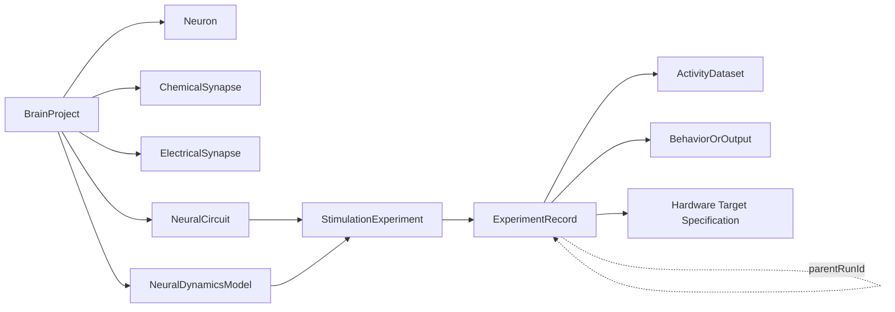

# 仿生大脑产品设计

> 状态：产品与架构方案，尚未实现。2026-10-10。
> 本文取代原“神经电路实验室”中把神经研究、忆阻器、芯片与 FPGA 串成一个产品的方案。
> 本轮只交付设计文档与效果示意，不代表 Studio 已能运行神经仿真。

## 结论

仿生大脑应是 CCLink Studio 中一个独立、本地优先的计算神经科学产品域。它帮助用户把“连接组数据”变成可检查、可刺激、可运行、可回放、可比较和可复现的神经动力学实验，但不把连接图、动画或求解器退出码误报为生物功能复现。

首版只保留两个核心页面：

1. **模型工作台**：在一个 Workbench Tab 内完成结构检查、回路选择、刺激配置、运行和活动回放。
2. **实验记录**：查看不可变运行证据、比较实验并按固定输入重跑。

创建、导入和修复缺口使用模态流程或右侧检查器，不各自增加页面。Studio 既有 Workspace、文件树、Workbench Tab、Agent、Terminal、命令、诊断和状态恢复继续承担通用职责。

首版的“建立模型”指从已验证参考包或受支持的声明式文件创建大脑项目、保存局部回路并修改明确开放的参数；不交付任意拓扑编辑器、方程 IDE 或脚本运行环境。

首个纵向闭环以一个冻结版本的 NeuroML 2/LEMS 线虫回路包和一个固定本地求解器适配器为候选基线。首选验证 c302 生成模型与 jNeuroML/jLEMS；只有在许可证、跨平台安装、确定性、输出语义和目标规模 spike 全部通过后，才把确切版本写入首版支持清单。首版不能同时建设多个求解器、通用插件系统或云端调度。

## 用户现在能做什么、还不能做什么

本轮完成后，用户只能阅读方案和交互示意；还不能在真实 Studio 中打开、刺激或运行线虫模型。

真正的首版交付必须让用户在真实应用中完成：

> 打开一个有明确来源的模型 → 选择并保存局部回路 → 配置有单位的刺激 → 通过真实求解器运行 → 用求解输出驱动网络回放和曲线 → 查看输出与证据 → 保存记录 → 从固定输入生成新 run 并重跑。

在该动作真实通过前，Schema、页面、mock、动画、自动测试或求解器命令行单独成功都只能算工程准备度。

## 目标用户、核心价值与使用场景

### 目标用户

| 用户 | 主要任务 | 首版价值 | 明确不承诺 |
| --- | --- | --- | --- |
| 计算神经科学研究者 | 检查模型、设计刺激、比较响应 | 把模型、运行输入、输出和证据放进同一可复现工作流 | 不替代同行评审或实验验证 |
| 秀丽隐杆线虫研究者 | 从完整结构定位已知细胞和局部回路 | 保留神经元身份、连接类型、来源与数据缺口 | 不把解剖连接直接当作功能连接 |
| 教师与学生 | 观察刺激如何在模型中传播 | 用真实方程输出驱动时间轴，而不是播放预制动画 | 不宣称教学示例就是生物真相 |
| 模型与算法开发者 | 导入模型、改变参数、回归比较 | 固定输入、环境指纹和输出判据，便于复现 | 首版不提供任意 Python 脚本执行或求解器插件市场 |

### 核心价值

- **结构、动力学和功能证据分层**：完整连接组、可运行模型和行为复现是三个独立结论。
- **从局部回路开始的真实计算**：完整网络可浏览，但首版求解规模由实测决定，不用一张 302 节点图掩盖求解缺口。
- **运行事实可追溯**：每次运行固定输入、模型 revision、引擎版本、随机种子、事件、输出和哈希。
- **与 Studio 一体但领域独立**：免登录、本地可用；CCLink 云、芯片软件和远程服务不可成为启动或运行前置。

### 典型场景

1. 从完整成体雌雄同体连接组中查找触觉相关神经元，保存一个局部回路，并查看化学突触与电突触各自的来源和缺口。
2. 打开一个 c302/NeuroML 回路模型，对单个感觉神经元施加电流刺激，回放膜电位或钙活动，并观察模型定义的输出神经元响应。
3. 复制实验，只修改刺激幅值或某个突触参数，对比同一变量、单位和时间窗内的两个 run。
4. 导入一组真实钙成像活动数据，与模拟活动并列查看；二者必须标明来源，不能混成一个“真值”。
5. 将已经通过软件参考测试的回路导出为 Hardware Target Specification，交给未来独立芯片软件；导出不在大脑项目中创建芯片、RTL、版图或器件对象。

## 科学依据与诚实边界

### 已知依据

- Cook 等人的成体线虫全动物连接组可提供雌雄同体与雄性的化学突触和 gap junction 邻接信息；它适合做结构来源，不等于动态参数或功能真值。
- Randi 等人的头部信号传播图谱覆盖大量单神经元刺激—响应对，并显示解剖连接不足以解释全部传播，突触外信号也会影响短时动力学。因此产品必须允许“结构边”和“功能响应证据”并存但不互相覆盖。
- c302 可从线虫连接数据生成不同生物物理层级的 NeuroML 2 网络，支持局部或全部 302 个成体雌雄同体神经元；其公开说明也明确部分配置并不产生生理真实结果。
- NeuroML/LEMS 能明确描述模型、仿真时长、步长、记录变量和输出；jLEMS 是单室模型的参考实现，复杂多室模型通常需要 NEURON 等后端。

### 仍未解决的数据缺口

| 缺口 | 产品处理 | 禁止结论 |
| --- | --- | --- |
| 神经元特异膜参数并不完整 | 参数逐项保存来源、置信度、适用范围；未知值保持缺失或明确标为假设 | “302 个神经元均已生物校准” |
| 化学突触正负号、强度和时序并非仅由接触数决定 | 结构权重、动力学参数和功能响应分别建模 | “连接数就是突触权重” |
| gap junction 电导和方向语义可能依模型而异 | 结构上保存无向连接，动力学层保存具体耦合方程和电导 | “所有电突触等价” |
| 神经肽、单胺等突触外调制未被普通 connectome 完整表达 | 作为后续独立 interaction layer；缺失时在范围声明中列出 | “有线连接图就是完整神经系统” |
| 神经活动到行为需要肌肉、身体和环境闭环 | 首版输出只称神经输出或肌肉活动代理量 | “看到传播动画即复现行为” |
| 个体、性别、发育阶段和实验条件不同 | 项目固定 organism/sex/stage/dataset revision | “一个模型代表所有线虫” |

### 求解规模假设

302 个节点本身不大，真正的规模由状态变量数、突触模型、步长、仿真时长、记录信号数和参数扫描次数共同决定。首版不预设“完整脑一定实时”。

实施前必须用最终候选引擎完成三组 spike，并记录 wall time、峰值内存、输出体积和数值稳定性：

1. 20–40 个神经元的局部回路，1–10 秒模拟，记录全部核心变量。
2. 302 个单室神经元的完整网络，先记录少量信号，再测试全量记录。
3. 取消、失败、输出损坏和重跑；验证部分输出与终态不会被误标为成功。

目标不是提前承诺实时倍速，而是用实测确定首版最大节点数、允许变量、最小步长、最长时长和输出预算。多室模型、参数扫描、批量实验和实时 60 FPS 全脑回放均不进入首版默认承诺。

## 核心对象

| 对象 | 定义与关键字段 | 不是 |
| --- | --- | --- |
| 大脑项目 `BrainProject` | 领域根；固定物种、性别、发育阶段、结构数据版本，索引模型、回路、实验、活动数据和运行记录 | 第二种 Studio Workspace |
| 神经元 `Neuron` | 稳定细胞 ID、名称、类型、位置/分区、注释、来源、动力学绑定状态 | UI 图上的圆点 |
| 化学突触 `ChemicalSynapse` | 有向 pre→post 连接；接触数、递质/受体证据、结构权重、动力学绑定和来源分别保存 | 默认兴奋或等同于电阻 |
| 电突触 `ElectricalSynapse` | 规范化端点对的 gap junction；结构证据与耦合参数分离 | 两条反向化学突触 |
| 神经回路 `NeuralCircuit` | 对项目中神经元和连接的保存引用、角色标注和边界规则；可包含选择查询的冻结结果 | 复制出的第二份网络 |
| 神经动力学模型 `NeuralDynamicsModel` | 方程、状态变量、参数、单位、初态、细胞/突触绑定、模型层级、来源和引擎兼容声明 | 连接组文件或求解器进程 |
| 刺激实验 `StimulationExperiment` | 可编辑协议：目标、刺激类型、时间函数、时长、步长、记录量、输出定义和判据 | 某次运行的成功状态 |
| 活动数据 `ActivityDataset` | 有来源、有单位、有时间基准的模拟或实测信号集合；记录信号到神经元/输出的映射 | 渲染层临时颜色 |
| 行为或输出 `BehaviorOrOutput` | 类型必须为 `neural-output`、`muscle-proxy` 或 `behavior`；保存计算定义、单位与证据要求 | 任意波形的营销名称 |
| 实验记录 `ExperimentRecord` | 一次不可变 run 的输入快照、引擎环境、事实事件、终态、输出索引、哈希、失败原因和父 run | renderer store、Agent 总结或可覆盖的历史行 |

### 关键关系

连接对象属于项目的结构快照；回路只引用它们。模型通过 binding 把方程和参数赋给结构对象。实验引用回路和模型；运行固定实验及其全部依赖。重跑永远创建新记录，不覆盖原记录。

## 完整用户流程

### 1. 创建或导入模型

- 用户在已有本地 Workspace 中执行“新建仿生大脑项目”或“导入 NeuroML/LEMS”。
- 新建可选择受支持的参考包；导入只解析声明式模型，不自动执行随包脚本。
- Studio 复制外部依赖进项目的受管理 `sources/`，记录来源 URL/DOI、许可证、原始哈希和导入器版本。
- 导入成功只说明“文件可读”；不会自动宣称结构完整或动态可运行。

### 2. 检查结构和参数缺口

模型工作台显示三份独立检查：

- **结构检查**：神经元身份、重复项、悬空连接、化学/电突触类型、所选数据集覆盖和来源。
- **动力学检查**：每个运行范围内对象是否绑定方程、参数、单位、初态和允许的刺激/记录量。
- **引擎检查**：模型特性是否被固定适配器支持，环境版本是否就绪，估算输出是否超预算。

每个缺口必须有对象 ID、严重级别、依据和允许动作。阻断项阻止运行；警告项可运行但进入输入快照并显示在结果页。

### 3. 选择神经元或局部回路

- 用户搜索神经元、框选图节点，或从已保存回路开始。
- 默认只显示局部一跳/两跳邻域；完整图使用聚合、过滤和矩阵视图，不把全部边强塞进一张图。
- “保存为回路”记录稳定对象引用、选择规则、边界连接和 revision，不复制神经元与突触。

### 4. 配置刺激

- 首版只支持经选定模型和引擎验证的刺激类型；优先从有单位的 current clamp/pulse 开始。
- 配置目标、幅值、单位、延迟、持续时间、重复方式、总时长、步长和记录信号。
- UI 明确区分“模型电流输入”和真实机械、化学或光遗传刺激；没有校准映射时不得改名为后者。
- 运行前显示将被固定的输入摘要和参数缺口。

### 5. 运行模拟

- 用户点击“运行”后，主进程先保存或明确采用草稿，构建依赖快照并校验 revision/hash。
- `BrainSimulationService` 创建 run ID、写入 `preparing` 事实，再启动固定参数数组的求解器进程。
- UI 只显示求解器/适配器实际报告的阶段、模拟时间或输出量；没有真实进度时显示不确定进度。
- 成功要求：进程成功退出、必需输出存在、可解析、单位和时间轴有效、哈希登记完成。判据通过与否单独计算。

### 6. 回放活动并查看结果

- 时间轴只从已索引的 `ActivityDataset` 取值；网络颜色、曲线和数值共享同一游标与 run ID。
- 回放可在网络图和曲线间联动选中神经元，但图形布局不改变结构或输出。
- 部分输出、降采样或缺失信号必须标明；不得用前端插值生成不存在的“传播事实”。
- 输出卡明确显示它是膜电位、钙活动、神经输出、肌肉代理量还是经验证行为。

### 7. 对比实验

- 用户从实验记录选择两个或多个 run。
- 默认只允许比较同一量纲、单位、对象和兼容时间基准；转换必须显式并写进比较定义。
- 对比展示输入差异、环境差异、波形差异和预先定义的量化指标，不能只叠两条线后声称优劣。

### 8. 保存并复现

- 首次 run 在创建时已写入不可变记录；用户可另存描述、标签和比较报告，但不能修改原始输出。
- “按固定输入重跑”从原 run 的 manifest 建立新 run，记录 `parentRunId` 和环境差异。
- 复现成功要求新 run 完成并按定义的数值容差通过；“命令再次启动”不是复现成功。

## 首版信息架构：只做两个页面

### 页面一：模型工作台

**页面目标**

让用户不离开一个 Workbench Tab 就能判断模型是否可运行，选择回路，施加刺激，启动真实计算并回放同一 run 的活动。

**主要区域**

- 顶部事实条：项目/模型 revision、结构状态、动力学状态、引擎状态、当前 run。
- 左侧模型导航：神经元搜索、已保存回路、结构/来源缺口。
- 中央网络画布：结构、矩阵或局部回路；回放时叠加真实信号。
- 右侧检查器：选中对象属性；切换到实验时显示刺激、求解设置和运行前检查。
- 底部时间轴与信号图：运行事件、真实时间游标、波形和错误；无输出时不显示伪波形。

**核心操作**

导入/重新解析、定位神经元、保存回路、配置刺激、运行、停止、选择信号、播放/暂停/拖动、跳到实验记录。

**空状态**

没有大脑项目时只提供“打开项目”“导入 NeuroML/LEMS”“从已验证参考包创建”。没有回路时提示先选择神经元；没有运行时底部显示运行条件，不放示例波形冒充数据。

**失败状态**

- 结构/参数缺失：定位到对象并说明为何阻断或仅警告。
- 引擎缺失/不兼容：仍可浏览和编辑；运行按钮禁用并给出探测事实。
- 运行失败/取消/中断：保留 run、事件和部分输出，终态明确，不把退出前最后一帧当成功。
- 输出解析失败：模型进程状态与结果可用性分开显示。

**数据来源**

保存的 BrainProject/模型/回路/实验文档、`BrainSimulationService` 事件、run 下原始与规范化输出。Agent 文本、renderer 计时器和画布动画都不是运行事实。

**真实完成标准**

在真实 Studio 中从有来源模型选择一个回路，配置有单位刺激，真实求解器产生可解析输出；网络和曲线由同一输出与时间游标驱动；关闭并重开 Tab 后仍能通过 run ID 找回终态和回放。失败与停止路径同样能正确对账。

### 页面二：实验记录

**页面目标**

让用户审计每次运行的固定输入和环境，对比结果，并从证据而非当前草稿重跑。

**主要区域**

- 左侧记录列表：状态、实验、模型 revision、创建时间和父 run。
- 中央详情/对比：输入差异、波形、输出指标、判据和警告。
- 右侧证据：manifest、引擎版本、随机种子、事件、文件哈希、诊断和来源。

**核心操作**

筛选、选择对比、固定单位/时间窗、打开原始输出、复制脱敏诊断、按固定输入重跑、导出复现包。Hardware Target Specification 是后续能力，首版不展示无实现的占位操作。

**空状态**

没有记录时解释“先在模型工作台运行一个实验”，并直接跳转；不生成虚构历史。

**失败状态**

记录损坏、输出丢失、环境不兼容或哈希不一致时进入证据故障态；仍可查看未损坏材料，但不能称可复现。比较维度不兼容时拒绝叠加并给出缺少的转换。

**数据来源**

run 目录中的 `record.json`、输入 manifest、事件日志、原始/规范化输出和比较定义；列表是可重建查询投影。

**真实完成标准**

用户能选择两个真实 run，看到输入与输出差异，关闭 Studio 后重新打开记录，并从旧 run 的固定输入创建新 run。新旧记录同时保留，复现判据来自计算结果而非 UI 判断。

## 三个验收层级

| 层级 | 必须满足 | 可以声称 | 不能声称 |
| --- | --- | --- | --- |
| 结构完整 | 对指定 organism/sex/stage/dataset revision 的预期神经元和连接覆盖可核对；化学/电突触类型、方向语义、重复/悬空项、来源和哈希明确 | “对所选结构数据版本完整” | 动态可运行、功能正确 |
| 动态可运行 | 运行范围内对象均有受支持方程、参数、单位、初态和刺激；固定引擎完成规范测试，输出可解析且数值稳定；失败/取消可对账 | “该模型配置可在该引擎上运行并产生这些变量” | 生物功能或行为已复现 |
| 功能复现 | 预先登记真实参考数据、刺激等价关系、输出映射、指标、容差和重复次数；独立 run 在适用范围内通过；行为还必须包含肌肉/身体/环境链路 | “在所述条件和误差范围内复现指定响应/行为” | 完整线虫智能或范围外功能 |

这三个层级不可相互推导。完整 connectome 可以没有可用膜参数；模型可稳定运行也可能给出错误生物结果；局部响应通过也不代表全脑或行为复现。

## 首个最小纵向闭环

### 候选基线

- **结构**：固定版本的成体雌雄同体连接数据，仅作为结构依据。
- **可执行模型**：冻结的 c302 生成 NeuroML 2/LEMS 局部回路包，优先选择已有公开示例和可解释输入/输出的咽部或感觉—运动回路。
- **引擎**：首选固定版本 jNeuroML/jLEMS 单室运行；若跨平台/规模 spike 不通过，则在实现前以同一 adapter contract 改选一个引擎，而不是同时交付两个半成品。
- **刺激**：模型定义的 current pulse；除非存在校准转换，不称机械或光遗传刺激。
- **结果**：膜电位/钙活动等模型变量和明确标注的输出代理量；不把网络着色称为行为。

### 真人验收动作

1. 在离线、未登录 CCLink 的 Studio 打开本地 Workspace 和参考大脑项目。
2. 在模型工作台看到结构来源、模型版本和未决警告，选择并保存一个局部回路。
3. 选择一个可刺激神经元，设置脉冲幅值、单位、延迟、持续时间、总时长和记录信号。
4. 运行前检查通过后启动；观察由主进程事实事件驱动的 `preparing → running → succeeded`，并能执行一次取消失败路径。
5. 成功后拖动时间轴；网络节点着色、数值和波形在同一时间点一致，且来源均指向当前 run。
6. 查看输出类型、输入 manifest、引擎版本、警告和文件哈希；保存实验说明。
7. 修改一个刺激参数生成第二次 run，在实验记录页对比同一信号和单位。
8. 关闭并重启 Studio，从第一次 run 的固定输入重跑，得到第三个 run；原记录不被覆盖，复现指标有明确结果。

### 首版退出条件

- 上述动作在真实 Studio 和固定环境完成并留存证据。
- 模型/引擎来源、许可证、版本和哈希已审查。
- 局部回路运行时间、内存和输出体积符合实施前设定的预算。
- 工具缺失、输入缺口、求解失败、取消、输出损坏、重启中断和 workspace 切换均有真实或自动化证据。
- 受影响 smoke 或 `pnpm verify` 通过；它只证明工程门禁，不替代上述真人闭环。

## Hardware Target Specification

Hardware Target Specification（HTS）是由已经固定的脑模型/回路/run 派生出的**单向导出契约**。它描述未来硬件实现必须满足的计算行为，不描述如何实现，也不把硬件对象写回大脑项目。

首版只定义可导出的字段，不要求实现导出器：

| 分组 | 大脑侧提供内容 |
| --- | --- |
| 来源身份 | brain project、circuit、model、reference run 的稳定 ID、revision、内容哈希和适用范围 |
| 计算要求 | 状态变量、更新方程或标准化模型引用、连接语义、同步/事件规则、步长或事件时间要求、初始化和随机性 |
| 输入 | 通道 ID、目标对象、物理量、单位、范围、采样/事件编码、时序约束 |
| 输出 | 通道 ID、对应状态/代理量、单位、范围、采样率、容许缺失和观测延迟 |
| 数值精度 | 参考浮点语义、动态范围、绝对/相对误差容差、饱和和舍入的允许误差；不指定 bit width 或器件 |
| 性能约束 | 最大端到端延迟、更新 deadline、吞吐、状态/连接规模和允许的抖动；这些是需求，不是面积/功耗结论 |
| 标准刺激 | 一个或多个固定刺激向量、时间表、初态和随机种子 |
| 参考结果 | 软件参考输出、哈希、比较变量、时间窗、指标与通过阈值 |
| 可追溯性 | 生成工具版本、导出时间、未解决警告和不支持特性 |

HTS 禁止包含：RTL、FPGA 工程、网表、忆阻器、晶体管、版图、PDK、时序收敛、面积、功耗估算或制造规则。未来芯片软件自行导入 HTS 并拥有所有硬件实现状态。

## Agent、Terminal 与诊断角色

- Agent 可以解释模型、查找缺口、提出回路或刺激草稿、总结真实 run，并通过统一 command 请求领域操作。
- Agent 不得写 `succeeded`、伪造活动数据、替代求解器计算或把自然语言判断写成验收证据。
- Terminal 允许用户手工探索，但 Terminal 输出不是受控 run。只有显式导入并标记为 external 的结果才能进入记录，且不能伪装成 Studio 管理的运行。
- 诊断必须关联 workspace、brainProject、experiment、run、engine 和阶段，默认脱敏并限制体积。

## 页面效果示意

- [聚焦首个纵向闭环的交互示意](../design/bionic-brain/pages.html)
- [示意源文件](../design/bionic-brain/pages.fragment.html)

示意只展示信息架构和状态关系；其中连接、参数、波形和终态都是样例，不是已经完成的仿真证据。

## 方案拷问

### 最可能错误的五个假设

1. **“完整 connectome 就能得到完整大脑。”** 错。它缺少足够的动态参数、调制、个体差异和闭环环境。
2. **“302 个神经元规模很小，所以全脑高保真一定容易。”** 错。状态维度、突触连续动力学、步长和记录密度可能支配成本。
3. **“c302 能运行，所以结果已生物可信。”** 错。它是多层级建模框架，部分配置明确不保证生理真实。
4. **“时间轴动画能证明信号传播。”** 错。只有可追溯的求解输出或实验数据能驱动事实回放。
5. **“未来要做芯片，所以现在应加入硬件对象。”** 错。大脑侧只需稳定导出计算契约；提前混入硬件会制造第二状态所有者和错误产品路径。

### 开始实现前必须关闭的决策

- 参考结构数据集的精确版本、授权、性别/阶段范围与导入格式。
- 首个 c302/NeuroML 模型包、参数集、刺激和可解释输出；哪些参数是测量值、拟合值或假设。
- jNeuroML/jLEMS 的版本、分发方式、Java 依赖、macOS/Windows/Linux 行为和取消语义。
- 局部、302 单室和全量记录三个 scale spike 的预算与结果。
- 首个“功能复现”参考数据、刺激等价关系、指标和容差；如果没有，只交付“动态可运行”。

### 下一步最该做什么

不要先造图编辑器或全量 Schema。先做一个限时技术/科学 spike：冻结候选参考包，在独立命令行环境完成一次局部回路真实运行、输出解析、取消和重跑，得到版本、许可证、性能、变量语义和参考判据。只有该证据成立，才把模型工作台的最小 UI 和 IPC contract 排入实现。

## 参考资料

- Cook et al., [Whole-animal connectomes of both *Caenorhabditis elegans* sexes](https://www.nature.com/articles/s41586-019-1352-7), Nature 2019.
- Randi et al., [Neural signal propagation atlas of *Caenorhabditis elegans*](https://www.nature.com/articles/s41586-023-06683-4), Nature 2023.
- Gleeson et al., [c302: a multiscale framework for modelling the nervous system of *Caenorhabditis elegans*](https://pmc.ncbi.nlm.nih.gov/articles/PMC6158223/), 2018.
- OpenWorm, [c302 repository and runnable examples](https://github.com/openworm/c302).
- NeuroML, [Simulating NeuroML models](https://docs.neuroml.org/Userdocs/SimulatingNeuroMLModels.html) and [LEMS simulation files](https://docs.neuroml.org/Userdocs/LEMSSimulation.html).
