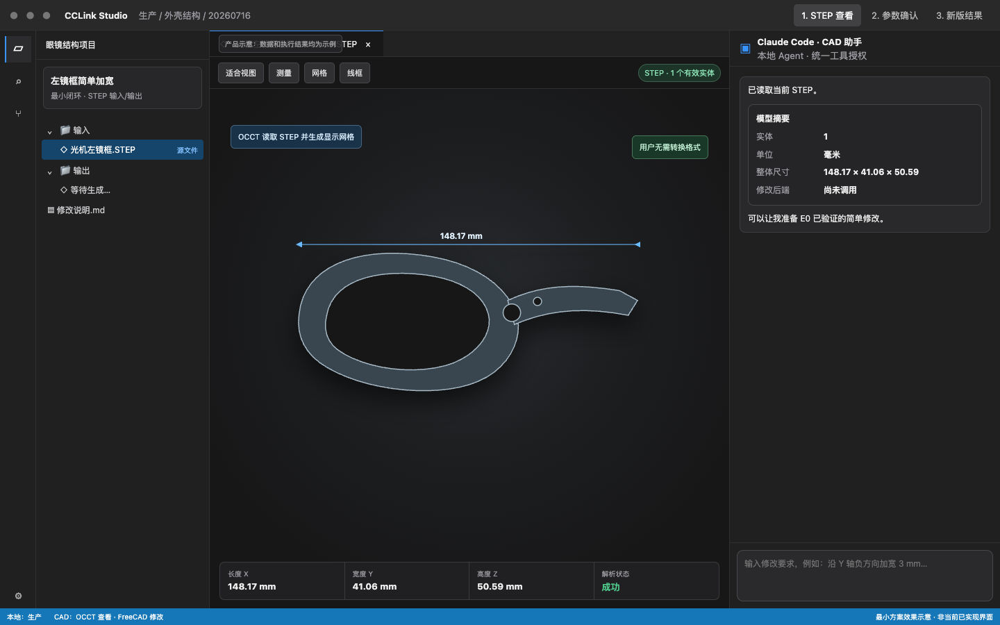
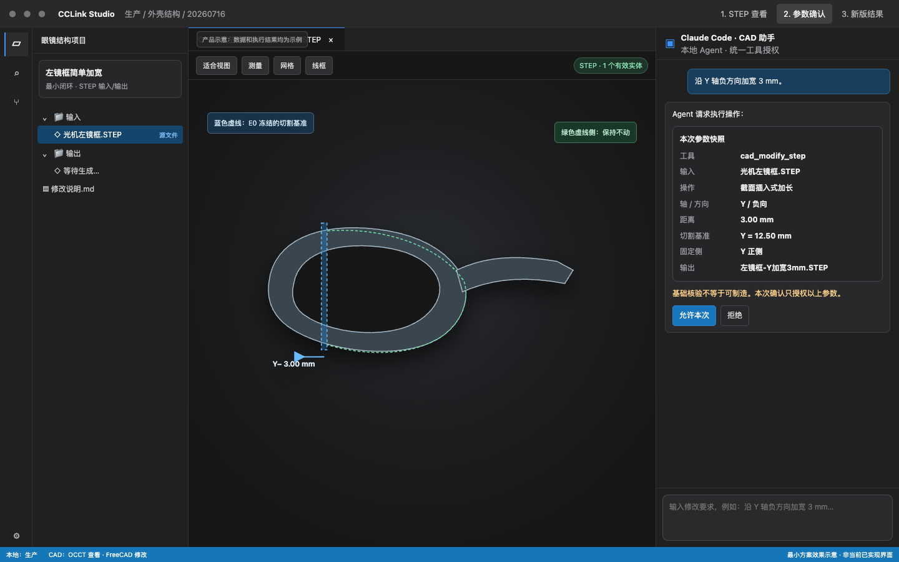
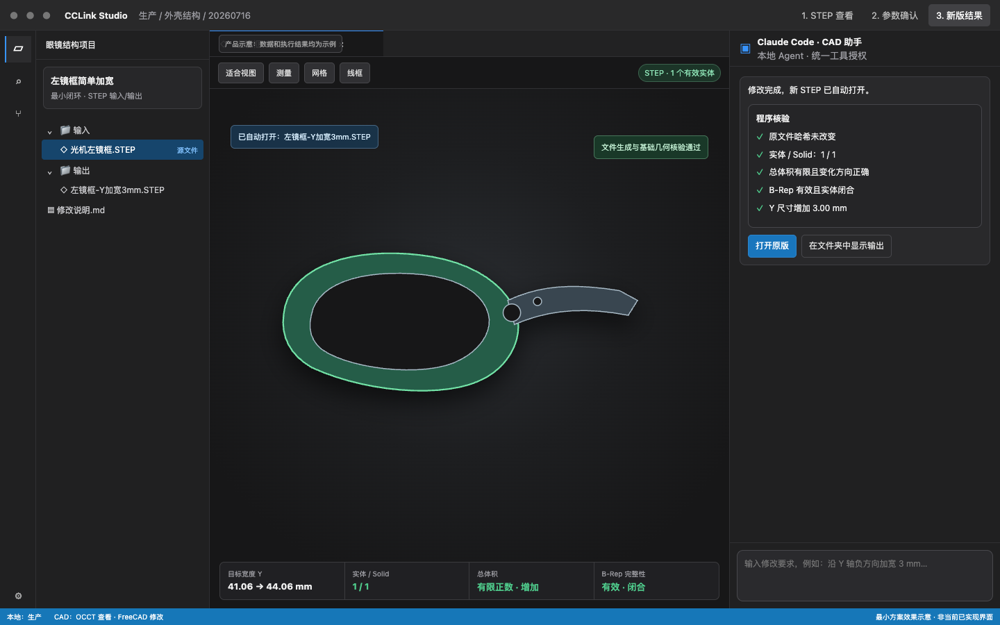

# 眼镜 STEP AI 简单修改

> 状态：最小闭环已实现；路径、固定区域、BOP 和取消链路已加固，并通过真实 FreeCAD 扩展矩阵。最后更新：2026-10-09。
> 关联：[开发与验收记录](./eyewear-step-ai-editing-development-plan.md)、[最小页面示意](../design/eyewear-step-ai-editing/pages.html)、[架构约束](../architecture.md)。

## 结论

Studio 现在支持这一条最小闭环：

```text
打开真实 STEP
→ 告诉本地 Agent 沿一个坐标轴做截面插入式加长或加宽
→ 查看并确认完整参数快照
→ FreeCADCmd 后台生成新的 STEP 副本
→ 程序重新导入并核验实体、体积、完整性和尺寸
→ Studio 自动打开新版 STEP，并在 Agent 中显示核验证据
```

用户操作的源文件和结果文件始终是 STEP。Studio 会在内部把 STEP 三角化为受控的预览网格，但用户不需要手工转 STL，也不需要打开 FreeCAD 界面。

首版只支持一种 `section-insert` 操作。它没有选面、装配、干涉、版本数据库、实物反馈、多编辑后端或可制造性判断。

## 用户现在能做什么

1. 在本地工作空间打开 STEP，旋转、缩放、显示网格或线框；
2. 让 Agent 对当前单实体 STEP 规划一次沿 X、Y 或 Z 轴的截面插入；
3. 在强制确认卡中核对源文件哈希、轴、方向、距离、截面、固定端、输出文件和预期尺寸；
4. 允许后生成一个不覆盖原文件的新 STEP；
5. 自动打开新版，并看到 B-Rep 尺寸、实体数量、体积、闭合状态、基础完整性和 BOP 检查结论。

用户现在还不能让 AI 任意拉伸曲面、点选局部面、自动处理装配约束，或直接据此判断文件可送加工。

## 页面示意

完整交互示意：[打开离线页面](../design/eyewear-step-ai-editing/pages.html)。示意图用于解释流程，真实验收结果见本文末尾。







## 产品分工

| 部分            | 本轮职责                                            | 边界                              |
| --------------- | --------------------------------------------------- | --------------------------------- |
| Studio          | 打开 STEP、展示参数确认、自动打开输出、显示核验证据 | 不是完整 CAD 编辑器               |
| 本地 Agent      | 理解意图，调用计划和修改工具，解释结构化结果        | 不生成或执行任意 CAD Python/shell |
| Agent 授权系统  | 唯一拥有待确认、允许和拒绝状态                      | CAD 服务不复制确认状态            |
| CAD 修改服务    | 执行已批准快照，管理 FreeCAD 子进程、临时文件和核验 | 不拥有会话、Run、版本或计划状态   |
| OCCT + Three.js | 三角化和绘制 STEP 预览                              | 预览网格不作为修改源              |
| FreeCADCmd      | 读取和修改 B-Rep，导出并重新导入 STEP               | 不向用户显示 FreeCAD UI           |

没有 FreeCAD 时，STEP 查看仍可用，只有编辑能力降级。编辑后端独立探测 `FreeCADCmd`，不受用户选择 OCCT 预览后端影响。

## STEP 显示与工程尺寸

- 源文件和输出文件都是 STEP；
- Studio 内部的 STL 只是缓存，不出现在用户流程中；
- 查看器标题栏显示的是三角化后的“预览网格包围盒 ≈”，适合确认外形和目标方向变化；
- Agent 结果卡显示的是重新导入 STEP 后的 B-Rep 包围盒，是本次尺寸核验依据；
- 真实样本存在曲面基线警告，预览网格包围盒可能与 B-Rep 包围盒不同；
- 能显示、尺寸门禁通过和结构可制造是三件不同的事。

## 唯一修改操作

首版只执行：

```text
按绝对坐标平面切分单实体
→ 固定 min 或 max 一侧
→ 将另一侧沿坐标轴移动指定距离
→ 用截面补齐中间实体
→ 融合、修复并导出新 STEP
```

约束如下：

- `operation` 固定为 `section-insert`；
- 轴为 X、Y 或 Z；
- 正方向必须固定 min 端，负方向必须固定 max 端；
- 距离为 `0.1–10 mm`；
- 当前门禁要求输入和输出都只有 1 个 STEP 对象、1 个封闭有效 solid；
- 输出路径必须位于当前本地工作空间，不能与输入相同，也不能覆盖已有文件。

整体缩放不会冒充局部加宽。Agent 也不能提交自定义 FreeCAD 脚本。

## 参数快照与权限

`cad_plan_modification` 只分析，不写文件。它返回源哈希、源 B-Rep 证据、截面证据、预期尺寸和完整 snapshot。

`cad_modify_step` 每次调用都必须通过现有 Agent 授权卡确认，`allowAlways: false`。确认卡显示：

- 输入文件与源 SHA-256 摘要；
- 操作、轴、方向、距离、截面位置和固定端；
- 输出路径；
- 预期 X/Y/Z 尺寸；
- “基础核验不等于可制造”的边界提示。

一次确认只授权这一份 snapshot。源哈希、参数或输出路径变化后必须重新规划并确认。工具入口还会检查 `confirmationGranted === true`，防止绕过确认卡。

文件权限继续由现有 `FileService` 和 ToolHost 的可信工作空间上下文拥有：

- STEP 预览转换前验证源文件属于 renderer 当前工作空间；
- `previewRef` 绑定 renderer、工作空间、源路径、源哈希和缓存格式；
- 修改工具分别验证输入文件和输出目标；
- FileService 把已授权源文件复制到应用私有快照，FreeCAD 不再直接读取用户路径；
- FreeCAD 只向应用私有临时目录写输出，核验完成后再由 FileService 独占发布；
- 发布前后固定父目录与目标文件身份，重新检查工作空间归属；路径换链、符号链接逃逸、旧源哈希和已有输出都会被拒绝；
- CAD 服务只运行 Studio 固定脚本，并在取消、超时或退出时终止子进程和清理临时文件。

## 自动核验

输出先写入应用私有临时目录。重新导入核验成功后，FileService 使用独占、不覆盖语义发布到最终路径。门禁包括：

- 源 SHA-256 在规划后和执行期间均未变化；
- 输出存在、非空，且脚本报告大小与磁盘一致；
- 输入和输出各有 1 个对象、1 个 solid，实体闭合、有效并通过基础 B-Rep 检查；
- 体积为有限正数，截面插入后体积增加；
- 目标尺寸误差不超过 `0.05 mm`；
- 固定端位移不超过 `0.01 mm`；
- 将源模型固定区域与输出同一区域做实体交集，体积对称差不超过 `max(0.002 mm³, 固定区域体积 × 0.2 ppm)`；两侧固定区域都必须保持单一、封闭、有效；
- 非目标轴尺寸误差不超过 `0.05 mm`；
- 执行带 BOP 的完整检查。

BOP 异常只接受 FreeCAD 已验证格式：异常类型、固定标题和每条错误明细必须全部解析，存在未知行、空错误类型或数量矛盾时直接拒绝发布。真实样本在修改前已有 `InvalidCurveOnSurface` BOP 警告，因此首版允许一个明确的“源基线警告”策略：输出不能新增错误类型，警告增长不能超过 64 条。结果状态为 `passed-with-baseline-warning`，并强制提示用户到专业 CAD 中复核。任何新错误类型、无法完整解析的异常或超出上限的增长都会拒绝发布。

规划和修改都使用当前 Agent Run 的同一个取消信号。取消规划后，正在运行的 FreeCAD 子进程会被终止，私有快照和临时结果会清理。

## 自动打开

只有当前本地工作空间、当前活跃会话和当前 `activeRunId` 的实时成功结果才会自动打开。renderer 会：

1. 识别原始 MCP 工具名及带命名空间的 `mcp__…__cad_modify_step`；
2. 解析结构化 `cad-modification-result`；
3. 再次检查输出路径属于当前工作空间；
4. 按 `toolUseId` 去重后调用现有 Tab Store；
5. 复用 STEP 预览链路加载并选中新版标签页。

历史对话恢复、非活跃 Run、远程工作空间、越界路径和失败结果都不会触发自动打开。

## 当前实现位置

- 预览权限与转换：`src/main/cad/cad-ipc.ts`、`cad-conversion-service.ts`、`occt-converter.ts`；
- 固定修改适配器：`src/main/cad/freecad-section-insert-script.ts`；
- 修改服务与 contract：`src/main/cad/cad-modification-service.ts`、`cad-modification-types.ts`；
- Agent 工具：`src/main/mcp/modules/cad/index.ts`；
- 确认摘要：`src/main/mcp/tool-confirmation-summary.ts`、`src/shared/ipc/agent.ts`；
- runtime 生命周期：`src/main/runtime/app-runtime.ts`、`optional-main-services.ts`、`automation-runtime.ts`、`core-services.ts`；
- 结果卡和自动打开：`ConversationMessageRenderer.tsx`、`use-agent-stream-events.ts`、`cad-modification-auto-open.ts`；
- STEP 查看：`ModelViewer.tsx`。

## 明确后移

- 模型选面和网格三角形到 STEP face 的映射；
- 任意局部拉伸、自由曲面或多种修改操作；
- 原版/新版并排、叠加和差异着色；
- PCB、电池、光学件装配定位和干涉检查；
- 专用版本管理和实物反馈页面；
- FreeCAD 受管下载、打包或嵌入 UI；
- FreeCAD 之外的第二个生产编辑后端；
- 强度、公差、注塑、CNC 或量产可制造性判断。

## 真实验收记录

样本：`/Users/apple/Desktop/生产/外壳结构/20260716/光机左镜框精简20260716.STEP`

2026-10-09 在真实 Electron 开发版完成：

1. 打开原 STEP，显示 1 个预览对象、17,034 个渲染顶点、5,678 个三角形和约 `148.17 × 41.06 × 50.59 mm` 的预览网格包围盒；
2. 对原文件规划 X 正方向加长 `3 mm`，截面 `3.7637202218503205 mm`，固定 min 端；
3. 确认卡完整显示 11 行参数，只有“允许/拒绝”，没有永久放行；
4. 允许后生成新 STEP 副本，原 SHA-256 保持不变；
5. 输出重新导入为 1 个封闭有效 solid，面数 `193 → 210`；
6. B-Rep X 尺寸 `148.17349677 → 151.17349677 mm`，Y/Z 不变，固定端误差小于 `0.01 mm`；
7. 体积 `10883.7083 → 11200.3532 mm³`；
8. BOP 警告 `186 → 204`，错误类型仍只有 `InvalidCurveOnSurface`，状态为 `passed-with-baseline-warning`；
9. Studio 自动新增并选中输出标签页，显示约 `151.17 mm` 的 X 向预览网格包围盒，Agent 结果卡显示完整核验证据。

验收输出：`光机左镜框精简20260716-X加长3mm-AI-验收2.STEP`。

该结果证明最小软件闭环可用；它没有证明镜框满足装配、公差、强度、工艺或量产要求。

### 2026-10-09 加固后的真实 FreeCAD 矩阵

同一个左镜框样本又执行了六个组合：

| 轴  | 方向 | 距离 | 固定端 | 结果 |
| --- | ---- | ---: | ------ | ---- |
| X   | 正向 | 0.1 mm | min | 通过 |
| X   | 负向 | 10 mm | max | 通过 |
| Y   | 正向 | 0.5 mm | min | 通过 |
| Y   | 负向 | 3 mm | max | 通过 |
| Z   | 正向 | 10 mm | min | 通过 |
| Z   | 负向 | 0.1 mm | max | 通过 |

六项均得到一个封闭有效实体，目标轴尺寸按指定距离增加，非目标轴保持在门限内，固定区域体积对称差在门限内，BOP 异常被完整解析并符合源基线策略。该矩阵覆盖 X/Y/Z、正负方向、距离下限 `0.1 mm`、上限 `10 mm` 和两个中间值；距离是连续参数，因此这不是对 `0.1–10 mm` 每个数值和任意截面的穷举证明。

### 加固后的真实 Electron 复验

随后在开发版 Studio 中对 Y 正方向 `0.5 mm` 完成完整用户链路：

1. Agent 调用 `cad_plan_modification`，显示源实体、截面、预期尺寸和 BOP 完整解析证据；
2. 用户回复继续后，`cad_modify_step` 仍弹出独立的强制参数快照确认卡；
3. 确认卡显示 Y、positive、0.5 mm、截面、固定 min、源哈希、输出路径和预期尺寸，只有“允许/拒绝”；
4. 允许后生成 `光机左镜框精简20260716-Y正向加宽0.5mm-AI-加固验收.STEP`，源文件 SHA-256 仍为 `28eef649…8f67`；
5. Studio 实时自动打开新版标签页，显示 1 个预览对象和约 `148.17 × 41.56 × 50.59 mm` 的预览网格包围盒；
6. 结果卡显示精确 B-Rep 尺寸 `148.17 × 43.40 × 50.59 mm`、1 个实体、体积 `10943.44 mm³`；
7. 固定区域几何差为 `1.304e-3 mm³`，小于本次 `2.000e-3 mm³` 门限；
8. 输出 BOP 为 194 条且“完整解析”，相对源模型 186 条未增加错误类型；可制造性警告仍可见。

新输出大小为 `813,902 bytes`，SHA-256 为 `db31cc8161d567953c1d01e66a46b56bce7ebf8b212f1b5ea36b5cbec5460106`。目标目录没有遗留 `.cclink-cad-*` 临时文件。

## 样本基线

- STEP AP203，毫米单位；
- 文件大小 `1,169,363 bytes`；
- SHA-256：`28eef649442705b570b2b5148a37663b99dc799fd1d5a65ce7cf2d1981680f67`；
- 1 个 `MANIFOLD_SOLID_BREP`、1 个 `CLOSED_SHELL`；
- FreeCAD 1.1.4 导入：1 个对象、1 个 solid、193 个面，闭合且基础检查有效；
- B-Rep 包围盒约 `148.1735 × 42.9023 × 50.5921 mm`；
- 体积约 `10883.7083 mm³`；
- 完整 BOP 检查包含 186 条 `InvalidCurveOnSurface` 源基线警告。
